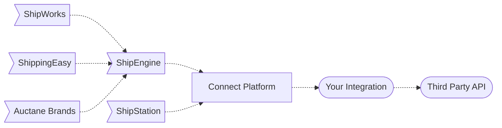

## How It Works
Our platform will make a call out to your integration which is hosted inside of a container. Your project implements and exposes an object that can be consumed by any runtime we build. By default your project is packaged with an http web service runtime. The general idea is that you are simply implementing methods that will be passed the body of the http request as the input to the method, and the response will be serialized and returned as the response.


All types that can be found in the api documentation have a corresponding model in the SDK.
 
```JavaScript methods/acknowledge-orders/index.js
const { logger } = require('@shipengine/connect-runtime');

/**
 * request will be the body of the http request
 */ 
module.exports.AcknowledgeOrders = (request) => {
  logger.info(
    'This is a log that I can find using the `shipengine-connect logs` command after publishing.'
  );
  return {
    responses: [
      {
        order_id: 'example_order_1',
        succeeded: true,
      },
      {
        order_id: 'example_order_2',
        succeeded: false,
        failure_reason: 'Invalid Order Id'
      },
    ]
  };
  /**
   * This will be serialized as this json response
   {
    "responses": [
        {
          "order_id": 'example_order_1',
          "succeeded": true,
        },
        {
          "order_id": 'example_order_2',
          "succeeded": false,
          "failure_reason": 'Invalid Order Id'
        },
      ]
   }
   */
}

```
```TypeScript methods/acknowledge-orders/index.ts
import {
  AcknowledgeOrdersRequest,
  AcknowledgeOrdersResponse,
} from "@shipengine/connect-order-source-api";
import { logger } from "@shipengine/connect-runtime";
/**
 * request will be the body of the http request
 */ 
export const AcknowledgeOrders = async (
  request: AcknowledgeOrdersRequest
): Promise<AcknowledgeOrdersResponse> => {
  logger.info(
    "This is a log that I can find using the `shipengine-connect logs` command after publishing."
  );
  return {
    responses: [
      {
        order_id: 'example_order_1',
        succeeded: true,
      },
      {
        order_id: 'example_order_2',
        succeeded: false,
        failure_reason: 'Invalid Order Id'
      },
    ]
  };
  /**
   * This will be serialized as this json response
   {
    "responses": [
        {
          "order_id": 'example_order_1',
          "succeeded": true,
        },
        {
          "order_id": 'example_order_2',
          "succeeded": false,
          "failure_reason": 'Invalid Order Id'
        },
      ]
   }
   */
};

```
:::info Recommendation
It is recommended to use TypeScript, it acts as safety rails to make sure you are adhearing to the specification. 
:::
