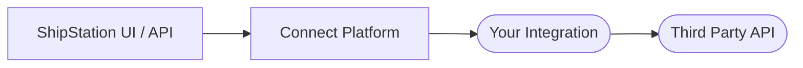
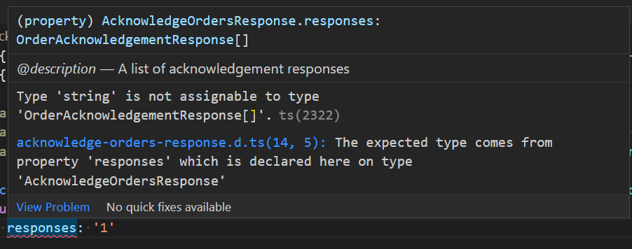

# How It Works
This documentation will guide you through building an integration for
ShipStation products, including ShipStation UI and ShipStation API.

Your project implements and exposes a set of functions that can be consumed by
our internal systems. For development, your project is embedded in an HTTP
web application. This demonstrates how your functions might be invoked within
our systems, while making it accessible to common tools like `curl` or [Postman](https://www.postman.com/).
The development server will pass the body of the HTTP request as input to
your function, and your function's result will be serialized and returned as
the HTTP response.


:::success Product Visibility
When an application is promoted to production it becomes available to consumers of the ShipStation products including ShipStation UI and ShipStation API.

***This however does not guarantee that a product will choose to include your integration in their service offerings.*** 

*For more details on product availability, please reach out to your business contact with Auctane or the [ShipEngine Connect Team](mailto:connect@shipengine.com).*
:::

The SDK contains a TypeScript type definition for each schema in the API documentation.
 
```JavaScript methods/acknowledge-orders/index.js
const { logger } = require('@shipengine/connect-runtime');

/**
 * request will be the body of the http request
 */ 
module.exports.AcknowledgeOrders = (request) => {
  logger.info(
    'This is a log that I can find using the `shipengine-connect logs` command after publishing.'
  );
  return {
    responses: [
      {
        order_id: 'example_order_1',
        succeeded: true,
      },
      {
        order_id: 'example_order_2',
        succeeded: false,
        failure_reason: 'Invalid Order Id'
      },
    ]
  };
  /**
   * This will be serialized as this json response
   {
    "responses": [
        {
          "order_id": 'example_order_1',
          "succeeded": true,
        },
        {
          "order_id": 'example_order_2',
          "succeeded": false,
          "failure_reason": 'Invalid Order Id'
        },
      ]
   }
   */
}

```
```TypeScript methods/acknowledge-orders/index.ts
import {
  AcknowledgeOrdersRequest,
  AcknowledgeOrdersResponse,
} from "@shipengine/connect-order-source-api";
import { logger } from "@shipengine/connect-runtime";
/**
 * request will be the body of the http request
 */ 
export const AcknowledgeOrders = async (
  request: AcknowledgeOrdersRequest
): Promise<AcknowledgeOrdersResponse> => {
  logger.info(
    "This is a log that I can find using the `shipengine-connect logs` command after publishing."
  );
  return {
    responses: [
      {
        order_id: 'example_order_1',
        succeeded: true,
      },
      {
        order_id: 'example_order_2',
        succeeded: false,
        failure_reason: 'Invalid Order Id'
      },
    ]
  };
  /**
   * This will be serialized as this json response
   {
    "responses": [
        {
          "order_id": 'example_order_1',
          "succeeded": true,
        },
        {
          "order_id": 'example_order_2',
          "succeeded": false,
          "failure_reason": 'Invalid Order Id'
        },
      ]
   }
   */
};

```
:::info Recommendation
If you use TypeScript, the tooling can help make sure you adhere to the specification.
For example, it can provide compiler errors when the object you return from
your function does not match the expected schema:  
:::
