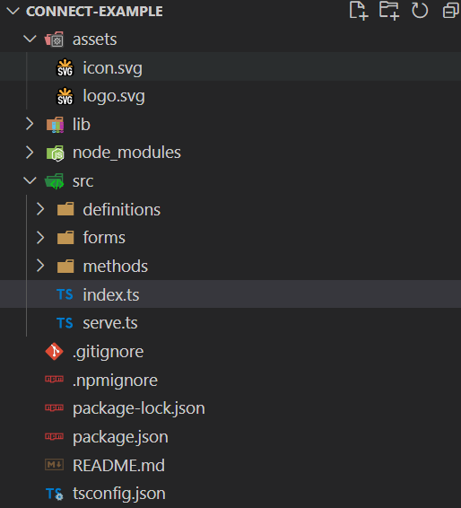

# Initialize Project
Running the command `init` will begin the process of creating a new ShipEngine Connect application.
```
shipengine-connect init
```


This will initialize a fresh project for you to get going with.

