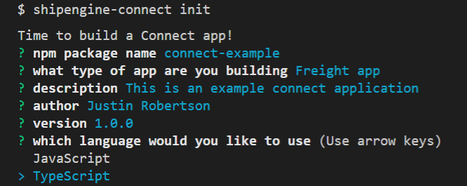

# Initialize Project
Running the command `shipengine-connect init` will begin the process of creating a new ShipEngine Connect application.

This will initialize a fresh project for you to get going with.

