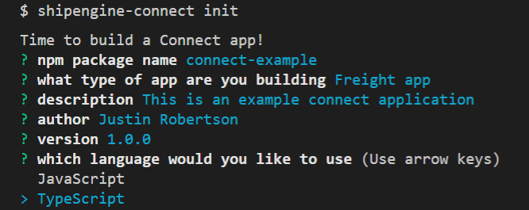
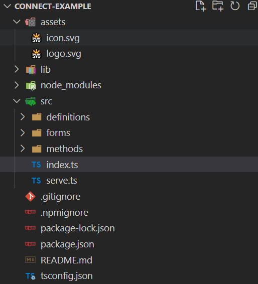

# Initialize Project
## Connect Init
The `init` command will begin the process of creating a new ShipEngine Connect application.

Create a new directory for your project and initialize Connect:

```bash
mkdir connect-example
cd connect-example
shipengine-connect init
```



This will generate a project structure to help build your integration.



## Integration Types
Learn more about the implementation details of the various ShipEngine Connect integration types.

* [Orders](../orders/index.mdx) - Import Orders, Notify Marketplaces, push and pull inventory
* [Shipping](../shipping/index.mdx) - Create Labels, Calculate or Retrieve Rates, Tracking
* [3PL](../fulfillment-provider/index.mdx) - Delegate orders, shipping notifications, etc...
* [Freight](../freight/index.md) - LTL
