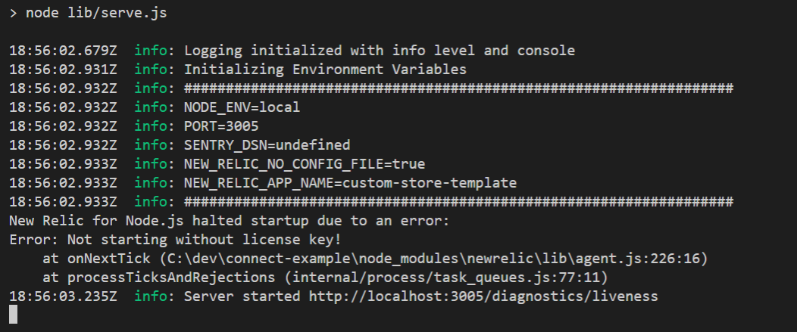

# Local Development
## Project Layout
```bash
.
assets/ # contains logos and icons
src/ # contains entry point of code
├─ definitions/ # contains definition files for metadata
├─ forms/ # contains registration / settings forms
├─ methods/ # contains functional implementation
├─ index.(ts || js) # exports object containing implementation and metadata definition
├─ server.(ts || js) # local test harness to run the definition from index as a web server
```

## Running Locally
:::info TypeScript
Make sure to run `npm run-script build` to transpile your TypeScript before running any local development commands.
:::

You can use the `npm start` command to run the test webserver locally:



This will start a web application running on `http://localhost:3005/`

From your browser you can go to `http://localhost:3005/docs` to see the OpenAPI
specification for your app.


You can use an application like [Postman](https://www.postman.com/) or `curl`
to make HTTP requests to the server. Each of the functions you write in
`src/methods` is exposed as an endpoint accessible via a POST request. For example,
to invoke the function `GetRates` that is defined in `src/methods/get-rates.ts`:

```
curl -X POST http://localhost:3005/GetRates
```

## Unit Tests
Another great way to test locally is to write unit tests for your code. For
example, you can use the [Jest](https://jestjs.io/) testing framework for
executing the methods without needing to use the HTTP server.

### Steps for Installing Jest
#### JavaScript
- Run `npm install jest --save-dev`
- Define the **test** command in **package.json** to invoke jest:

```JSON
{
        "scripts": {
            "test": "jest"
        }
}
```

- Add a root level **tests/** directory
- Add a test Example: **tests/sales-order-export.test.js**

```JavaScript
// /tests/sales-order-export.test.js
const { SalesOrdersExport } = require('../src/methods/sales-orders-export/index');
describe('When SalesOrderExport is called with a valid request',() => {
    it('it should export at least one sales order', async () => {
        const results = await SalesOrdersExport({
            auth: {
                username: 'name',
                password: 'password'
            },
            criteria: {
                from_date_time: '2022-04-04T00:00:00.000Z',
                to_date_time: '2022-04-18T00:00:00.000Z'
            }
        });
        expect(results.sales_orders.length).toBeGreaterThanOrEqual(1);
    })
})
```
- Run tests by using `npm run-script test`

#### TypeScript
- Run `npm install jest @types/jest ts-jest --save-dev`
- Run `npx ts-jest config:init`
- Define the **test** command in **package.json** to invoke jest:
```JSON
{
        "scripts": {
            "test": "jest"
        }
}
```
- Add a root level **/tests/** directory
- Add a test Example: **/tests/sales-order-export.test.ts**
```TypeScript
// /tests/sales-order-export.test.ts
import { SalesOrdersExport } from "../src/methods/sales-orders-export";
describe("When SalesOrderExport is called with a valid request", () => {
    it("it should export at least one sales order", async () => {
        const results = await SalesOrdersExport({
            transaction_id: "",
            auth: {
                order_source_api_code: "",
                username: "name",
                password: "password",
            },
            criteria: {
                from_date_time: "2022-04-04T00:00:00.000Z",
                to_date_time: "2022-04-18T00:00:00.000Z",
            },
        });
        expect(results.sales_orders.length).toBeGreaterThanOrEqual(1);
    });
});
```
- Run tests by using `npm run-script test`

:::warning Mocking
You can mock function calls to the outside world with Jest. This can be extremely useful for testing without needing valid credentials. Documentation can be found on [Jest's website here](https://jestjs.io/docs/mock-functions)
:::

## Verifying App Packaging

The `shipengine-connect pack` command allows you to package your application without
publishing it. It moves your `dependencies` into `bundledDependencies`, runs
`npm pack`, and creates a [tarball](https://en.wikipedia.org/wiki/Tar_(computing))
in the root of your project that you can inspect.

:::warning
If a tarball already exists in the root of your project, it will be overwritten.
:::

This provides you with visibility as to exactly what is being sent to ShipEngine
Connect. This is useful for ensuring that you are not sending us any sensitive
data. It is also helpful in making sure you aren't including any unnecessary files
in your package. For example, this may help you identify packages that are listed
in your `dependencies` that should actually be listed in your `devDependencies`.

We suggest that you use the
[`files` property](https://docs.npmjs.com/files/package.json#files) of your
`package.json` file to list which files to _allow_ in the package. Likewise, you
can create a [`.npmignore` file](https://docs.npmjs.com/using-npm/developers.html#keeping-files-out-of-your-package)
to specify which files to _exclude_ from your package.

```
shipengine-connect pack
```
