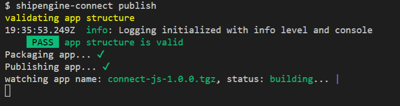

# Publishing

:::warning Self Integrators
Please contact the [ShipEngine Connect Team](mailto:connect@shipengine.com) at [connect@shipengine.com](mailto:connect@shipengine.com) and let them know that you are interested in becoming a self integrator.<br/><br/>
**A signed contract must be in place prior to an integration going live.**
:::

## Publish Command
You can run the `shipengine-connect publish` command to publish your project
to our test environment, where you can interact with it via the ShipStation user
interface.



After your app is successfully published you will be given login credentials to
a the [ShipStation test instance](https://ship-devss111.sslocal.com/).

## Logging
While testing through ShipStation, you can access all of the logs your project
produces via the `logs` CLI command:

**Show logs for the current project**
```
shipengine-connect logs
```

**Capture the logs in a file**
```
shipengine-connect logs > logfile.log
```

:::info Note
The `logs` command will return all of the log messages since the last `publish`.
When you `publish` again, it will reset the logs.
:::
