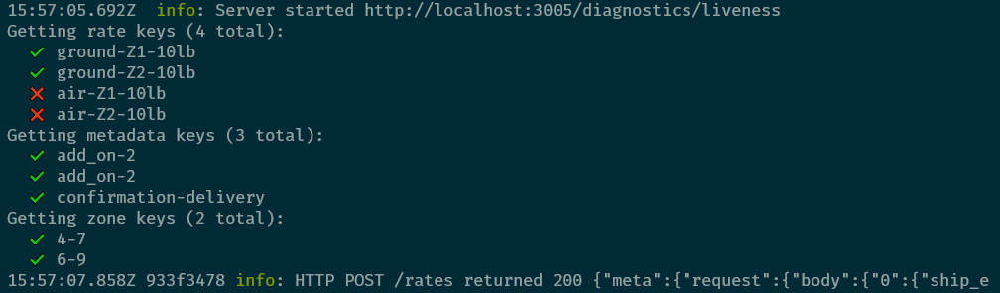

## Building a Native Rating implementation

### Install the CLI

First, ensure that you have [Node](https://nodejs.org/en/) v12+ and [Git](https://git-scm.com/book/en/v2/Getting-Started-Installing-Git) installed. Mac users will also need the development tools installed, but you will be prompted to install them
when you run the CLI.

To install [ShipEngine Connect CLI](https://connect.shipengine.com/), run the following command from your terminal:

```bash
npm install --global @shipengine/connect
```

Verify that the CLI was installed correctly:

```bash
connect --version
```

### Create the Native Rating app

The Connect CLI can create a Native Rating app for you by running the following from your command line,
replacing `my-native-rating-app` with the path you want to use for the app:

```bash
mkdir my-native-rating-app
cd my-native-rating-app
connect init
```

When this is finished, you will have a "fully working" Native Rating connect app, ready to be modified however you see fit.

## Configuration

Before building your implementation, it is recommended to get the basic configuration out of the way.

### AppID

The appId is a unique identifier required by Connect and cannot change after the app is first published. The CLI will
creates a random GUID and it is located in the `appId` property in `package.json` at the root of the app package.

### Name and ApiCode

ApiCode is how the carrier will be referenced when getting rates from the Native Rating system. It must be unique across
all carriers in the Native Rating system and if you want to make rates available through the platform automatically, this
value must match the `apiCode` of a carrier defined in a Carrier API Connect app. This value also must not change after
the initial publish, so it should be changed immediately.

Name is required but is not as important as the ApiCode or AppID. It can be changed at any time and is not required to
be unique.

Both values are in the Native Rating metadata file located at `./src/definitions/index.ts` and the default values look like this:

```typescript
export const Metadata: NativeRatingAppMetadata = {
  ApiCode: "demo_carrier",
  Name: "Demo Carrier",
};
```

### Rating data

The last bit of configuration that should be done is to set the id of the rate card managed by Connect. This can be done at
any time and can change at any time, as well. If you _do_ change the name of the rate card, the previous rate card will
**NOT** be removed the next time you publish the Connect app; however, a new rate card will be created.

The rest of the rating data can be changed at will and will overwrite any changes made manually via the Native Rating api. No other
rate card or zone set data will be modified: only the rate card and zone set with the id specified in the rating file will
be overwritten.

This data is in the file located at `./src/demo-data.ts` and the default values look like this:

```typescript
export const demoData: RatingAndZoneData = {
  rate_card_id: "default-rate-card",
  currency: "USD",
  rates: [
    { key: "ground-Z1-10lb", value: "105" },
    { key: "ground-Z1-20lb", value: "205" },
    { key: "air-Z1-20lb", value: "1205" },
  ],
  variables: [{ key: "add_on-1", value: { adjustment: 3.5 } }],
  zones: [
    { key: "4-7", value: "Z1" },
    { key: "6-99752", value: "Z99" },
  ],
};
```

### Build configuration

The package created by the Connect CLI uses WebPack to bundle the implementation and the configuration for this is in
`./webpack.config.js`. Modifying this file can break the deployment process so only make changes if you know how it will
affect the output and it is advised to keep a backup if you're not using source control.

If you are using Typescript for your app, configuration will be stored in `./tsconfig.json` but again, it's advised that
you don't modify this if you can avoid it. As before, it's worth keeping a backup if you're not using source control.

## Implementation

When the app shell is built and configured, you can [build your rating logic](./rating-logic.md). The linked document has instructions
for building the logic from scratch, but the Connect CLI gives you a shell function to start with, located either at `./src/implementation/rate-shipments.js` or `./src/implementation/rate-shipments.ts`, depending on whether you chose Typescript or Javascript
as your language.

Any data necessary for testing can be stored in teh `./src/demo-data.ts` file described in the configuration section of this document.
Rates should go in the `rates` array, variables in the `variables` array, and zones (if you're using zones) in the `zones` array.

## Testing

The Connect tooling provides a simple test server that you can use to test your app. To start it, run the following commands:

```bash
npm run build   # Run before first start and after any data changes
npm run bundle  # Run after any rating implementation changes
npm start
```

As pointed out by the comments, you only need to build before your first test run and after any changes made to the data. You only
need to run bundle after making rating logic implementation changes. It doesn't hurt to run both before every start, however. Once
the test server is running, you can make a request to `http://localhost/3005/rates` with shipment information, and should see output
similar to the following:



The server will show you which rate, metadata, and zone keys were requested and which were found in the sample data. The server will also expose a [docs endpoint](http://localhost/3005/docs) that will serve the OpenAPI spec of the Native Rating server. This will provide the shape of the input and output required by the `rates` endpoint.

## Deployment

### Linking to Carrier API

**NOTE**: This is mentioned before the publish instructions because it requires modifying your
`apiCode` which can only be done before your initial publish.

If you want to make your rates available to the platform and not just via the Native Rating service directly, you will need to
link your Native Rating app to a carrier in a [Carrier API](https://connect.shipengine.com/docs/app-definition/carrier)
Connect app. Creating the app is beyond the scope of this document, but once created it is only a few steps to get your
Native Rating app linked.

First, you will need to make sure that the `apiCode` defined in the `./src/definitions/index.ts` file matches the `ApiCode`
of the carrier definition in the Carrier API app **exactly**. In a newly created Carrier API app, this would be in the file
located at `./src/definitions/demo-carrier/index.ts`. It is possible that your carrier definition does not have an ApiCode,
and if it doesn't, you'll need to add it at the root of the carrier:

```typescript
export const DemoCarrier: Carrier = {
  // DO NOT CHANGE THIS ID AFTER PUBLISHING
  Id: "23a9753b-159b-4dd0-ac0e-6be065dccdd0",
  Name: "Demo Carrier",
  ...
  ApiCode: "demo_carrier",
  ...
};
```

The next step is to add a `NativeRating` property to the same carrier definition, specifying the Native Rating appId and
the id of the default rate card that should be used by requests from the platform.

```typescript
export const DemoCarrier: Carrier = {
  // DO NOT CHANGE THIS ID AFTER PUBLISHING
  Id: "23a9753b-159b-4dd0-ac0e-6be065dccdd0",
  Name: "Demo Carrier",
  ...
  NativeRating: {
    AppId: "c1d1cf8d-71b7-4939-a04d-2f4e46904231",
    DefaultRateCard: "default-rate-card"
  }
};
```

The `AppId` can be found in the `package.json` file of the Native Rating app. The default rate card can either be the id
of the Connect managed rate card specified in the `./src/demo-data.ts` file or a different rate card managed manually
via the Native Rating api. The default rate card can be changed at any time so even if you're using a manually managed
rate card, it may be worth starting out with the Connect managed rate card to ensure everything is working correctly
in ShipStation or ShipEngine and changing it after that.

When those changes have been made, your Carrier API app changes are ready to be published but you'll need to publish
the Native Rating app first.

### Publishing the Native Rating app

When the implementation is complete, you can use the Connect CLI to publish the Native Rating app to the development
environment for live testing. To do this, ensure that the package is built and bundled by running the following:

```bash
npm run build
npm run bundle
```

When that is finished, publish the app using the Connect CLI:

```bash
connect publish
```

This will ask for your api key which you should have received before building your integration. If you do not have one,
contact the [ShipEngine Connect team](mailto:connect@shipengine.com). The publish process can take some time, but once
it is complete your rates will be available directly via the Native Rating service.

If you are linking the Native Rating app to a Carrier API app, you can publish those changes now.

:::warning Note
Please note that publishing the Native Rating app from the Connect CLI makes the carrier available in Native Rating Service that can be accessed from development environments, like DDEs. To get the carrier rates in production, the carrier data needs to be [published](https://connect-rating.shipengine.com/app/publishing) via Native Rating.
:::

:::info Seller-specific Rate Card
If there are seller-specific rate cards, please contact the [Native Rating team](mailto:connect@shipengine.com) to have the rate card applied to the particular seller.
:::
