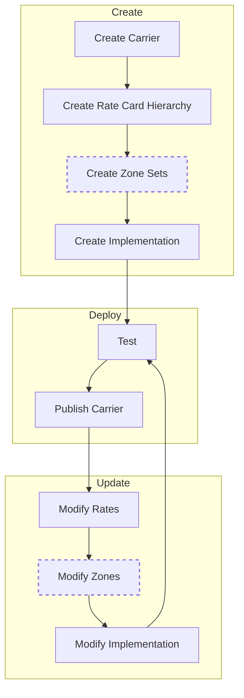

# Native Rating

Connect Native Rating package allows carrier implementers to rate natively through Connect instead of using an API that lives outside of the Auctane platform. To do this, an implementer will need to build rating logic and publish that to Connect. Once the code is published, rating data can be managed through Native Rating Service directly.

## What is Native Rating?

Native Rating is the engine that runs carrier rating logic and provides key/value access to rating data through a hierarchy of [Rate Cards, Rate Sets, and Rate Tables](./rate-card-structure.md). This data access is abstracted from the carrier implementation so that development can focus on the rules of rating. Carrier rating logic and data has to be provided by the implementors. This document will focus on building the logic for rating via Native Rating.

## Basic Concepts

There are two types of data used by Native Rating implementations: [rate data](./rate-card-structure.md) and [zone data](./zone-chart-structure.md). Zone data is useful for carriers that break their rates up into zones but carriers that don't can ignore zones while rate data is required by all integrations. The different levels of rate and zone data is important for managing the data, but it can be ignored when building the rating logic. This is because Native Rating takes care of using the correct rate sets and rate tables for a given request. The rating logic can request a specific data key and Native Rating will get the value that is applicable based on the requested rate card, effective dates of the rate sets, and hierarchy of the rate tables.

Changes that you make to rate cards, zone sets, and rating logic are not immediately available to end users. This allows you to test and fine-tune the data and logic before anyone else see the changes. To make changes available you need to publish the carrier in the Native Rating Service. This will take a snapshot of the carrier data and logic at that point and use that for all rate requests that don't explicitly ask to use different data. After you've published the carrier, you can start making changes again without affecting the live rates that are served to customers.

To test rates that are in development, you can make a rates request like you normally would with the addition of a special header: `request-date: unpublished`. This will instruct the Native Rating service to use the absolute newest data and logic whether it has been published or not. You can also use that header to request historical data by passing a date, like this: `request-date: 2021-11-03T09:34:16.123Z`. This would cause the Native Rating service to use the published data and logic as of the specified date. If you want the most current published rates, it's best to omit the `request-date` header rather than passing the current date and time in because the Native Rating service has performance optimizations for currently published rates that are bypassed when a date is specified.

:::warning Note
Once rates are published, they CANNOT be unpublished. There is a mechanism to re-publish the previously published data, however. The end result for live data is the same as unpublishing but the distinction is that if a request is made using the `request-date` header with the date and time that is within the window that the unwanted published data was available, those rates will still be served.
:::

## Workflow

The typical workflow for a Native Rating integration looks like this:

As mentioned above, the `Create` phase can be done via Native Rating Service or using the Connect tooling.

The `Deploy` phase must be done via the Native Rating Service. If you've deployed the integration using the Connect tooling and have linked it to a Carrier API app, you should be able to test rating through ShipStation on the integration DDE. This environment will get rates using unpublished rate data so you can make changes and see the changes in real time. You can also test by making rate requests directly against the Native Rating service.

After you've completed testing, you will need to publish the carrier in Native Rating Service. This "locks in" all the modified data and it will be used by default for all rate requests.

At this point, you can start modifying rates and logic again as needed and the update-deploy cycle can start again.

:::success Get Started
Begin creating your first [Native Rating Implementation](./implementation.md).
:::
