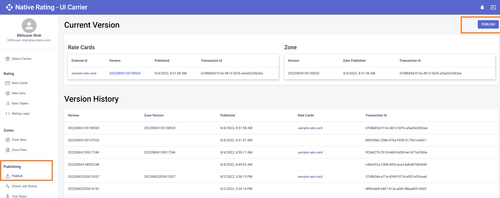

# Publishing Carrier Data

The carrier rating logic, rates, and zones data need to be published via [Native Rating](https://connect-rating.shipengine.com/app/publishing) to be made available in production environment. Please note that `connect publish` pushes the data to Native Rating System and keeps it in an unpublished state. Unpublished data are only available in development environments, like DDEs, or via [Native Rating](https://connect-rating.shipengine.com/app/getRates) with the special header: `request-date: unpublished`. Once rating logic and data are finalized and ready for production, the carrier data can be published in [Native Rating](https://connect-rating.shipengine.com/app/publishing).

## Republishing

:::info NOTE
Once rates are published, they CANNOT be unpublished. There is a mechanism to re-publish the previously published data, however. The end result for live data is the same as unpublishing but the distinction is that if a request is made using the `request-date` header with the date and time that is within the window that the unwanted published data was available, those rates will still be served.
:::
