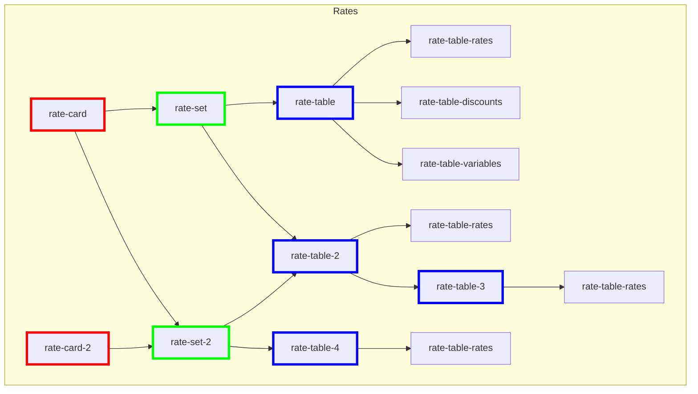

# Structure of a Rate Card

The main components of the domain model are the rate card, the rate set, and the rate table which is composed of individual rates. The specifics around each of these and their relationships to each other are described below.

## Data Structures

### Rate

A key-value pair defined by the shipping provider/integrator. Key naming/generation is unique to a shipping provider with the value being the corresponding price. For example, a key-value pair of [zone-3-priority-3lb, 5.35] could be used to specify the cost for 3 lb package being shipped Priority Mail to Zone 3. These key/value pairs are used to lookup/calculate rates when a rate request is made.

### Discount

Similar to a rate, this is a key-value pair defined by the provider/integrator to represent a type of discount (a percentage, or a flat dollar amount) to take into consideration when calculating the total shipment cost. Keys should match existing rate keys, and will be applied when retrieving a rate from the Native Rating system. To apply a discount to the example above, you would define a discount like [zone-3-priority-3lb, { type: percentOff, amount: 0.1 }] to provide a 10% discount for a 3 lb package being shipped Priority Mail to Zone 3.

### Rate Table

Container for a collection of rates and discounts allowing rates to be logically grouped together in a manner that best fits a specific shipping provider implementation. Rate tables can be as course or granular as needed. For example, a provider/integrator may choose to create distinct rate tables for each mail service (e.g. Priority Mail, First Class, etc.) or choose to merge everything into a single table.

### Rate Set

Container for grouping rate tables together into logical sets. Rate Sets can be organized in any way a provider/integrator sees fit. An effective date and expiration date can be defined for each rate set. This allows for new rate tables and rates sets to be pre-loaded ahead of their effective date for testing and validation purposes. When the previous rate sets expire, the new rate sets to go into effect. For example, a rate set may be defined for 2020 USPS retail pricing while a separate rate set would be defined for 2021 USPS retail pricing. Rate sets effective and expiration dates can overlap, which would allow multiple rate sets to be in effect at once.

### Rate Card

A rate card is the highest level data structure. A rate card is composed of one or more rate sets. Each customer/shipper can be assigned to a rate card which establishes the rates made available to a customer. For example, a USPS One Balance rate card is assigned to one set of customers to offer discounted USPS postage while a "retail" rate card may be assigned to other groups of customers. This mechanism also supports a customer to bring an NSA into the system. (The responsibility of linking/tracking customers to rate cards is outside the scope of this domain.)

## Advanced Topics

### Variables

Key-value pairs that can be used to store arbitrary data (e.g. variables, flags, etc.) that can be used for anything that could be customer specific or that may change over time.

As an example, assume that a carrier has a rule that after a certain weight, a fuel surcharge will apply to a shipment. Since this surcharge can be negotiated, the weight at which the surcharge goes into effect and the cost of the surcharge may need to be different per customer. This could be accomplished with two variable entries: [weight-surcharge-cutoff, 100] and [weight-surcharge-amount, 13]. This would create a cutoff weight of 100 (unit of weight is up to the carrier) with a cost of 13 (again, currency is up to the carrier). This could be defined in a base rate table that is gets used by all rate cards. Then, when a customer negotiates a higher weight cutoff or a lower cost, either or both of the keys could be overridden in a new rate table and then linked to that customer's rate card.

### Rate Table Inheritance

Rate tables can inherit from other rate tables. This helps to minimize the amount of data and complexity that comes along with supporting multiple rate cards within a specific shipping provider. For example, discounted rates could be defined through a discounted table that inherits from a "retail" rates table. Any rates (or discounts) defined on the discounted table would override those rates defined on the retail table. This drastically reduces the amount of data needed to be maintained in the discounted rate table.

## Visualization

This is a visualization of a possible rate card structure. You can see that a rate card can be associated with any number of rate sets and a rate set can be associated with any number of rate cards. Rate sets can be associated with any number of rate tables and a rate table can be associated with any number of rate sets. A rate table can also inherit another rate table. Finally, the actual rating data can only be associated with a single rate table.

