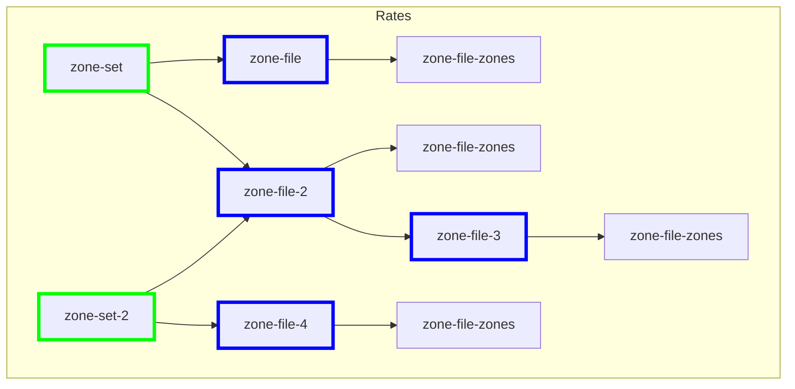

# Structure of a Zone Chart

The main components of the domain model are the zone set and the zone file which is composed of individual zone data. Zones are an optional feature that Native Rating provides, but that is not required to be used. It is helpful to use for carriers that break their shipping rates into zones, but much less useful for carriers that don't. The specifics around each of these and their relationships to each other are described below.

## Data Structures

### Zone

A key-value pair defined by the shipping provider/integrator. Key naming/generation is unique to a shipping provider with the value being the corresponding zone data. For example, a key-value pair of [10001-90009, 9] could be used to specify that a shipment from postal code 10001 to 90009 is considered zone 9. These key/value pairs are used to get shipping zones when a rate request is made.

### Zone File

Container for a collection of zones allowing data to be logically grouped together in a manner that best fits a specific shipping provider implementation. Zone files can be as course or granular as needed. For example, a provider/integrator may choose to create distinct zone file for each block of postal codes (e.g. all origin postal codes that start with 6 will be in a single zone file) or choose to merge everything into a single file.

### Zone Set

Container for grouping zone files together into logical sets. Zone Sets can be organized in any way a provider/integrator sees fit. An effective date and expiration date can be defined for each zone set. This allows for new zone files and zone sets to be pre-loaded ahead of their effective date for testing and validation purposes. When the previous zone sets expire, the new zone sets to go into effect. For example, a zone set may be defined for 2020 while a separate zone set would be defined for 2022. Zone sets effective and expiration dates can overlap, which would allow multiple zone sets to be in effect at once.

### Zone File Inheritance

Zone files can inherit from other zone files. This helps to minimize the amount of data and complexity that comes along with supporting complex zone rules within a specific shipping provider. For example, a base zone file could be created that contains course grained zone data that doesn't change often. Shipments from postal codes 1xxxx to postal codes 9xxxx will usually be zone 7. Then more specific zone files could be created that contain exception postal code ranges that change yearly. In this case, only the exceptions would have to be modified each year instead of the entire zone file.

## Visualization

This is a visualization of a possible zone chart structure. You can see that there can be any number of zone sets. Zone sets can be associated with any number of zone files and a zone file can be associated with any number of zone sets. A zone file can also inherit another zone file. Finally, the actual zone data can only be associated with a single zone file.

