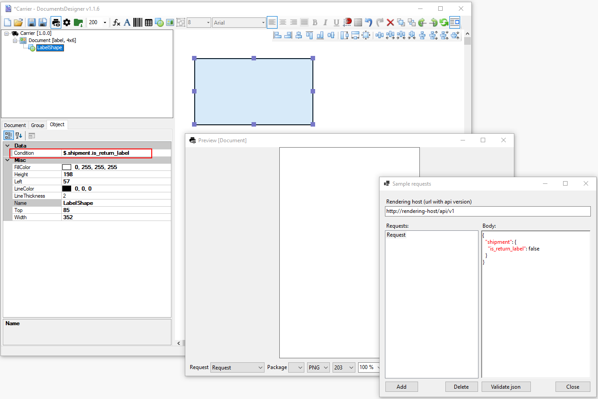
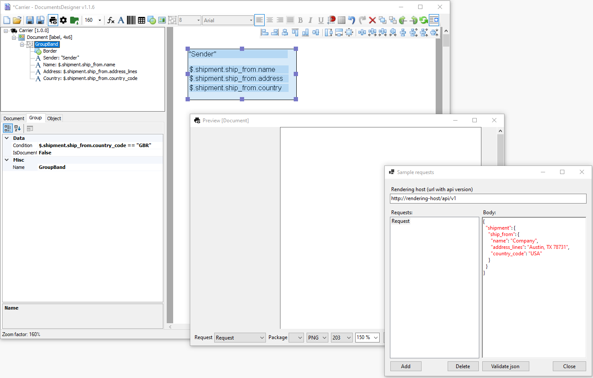

# Conditions

In Document Designer, we can operate on objects using conditions. It allows us to decide when a particular object or group of objects will be displayed on our label.

For example, we have an object of type Shape. Normally, when we put such an object on our design field, it will be visible on the preview. 

By default, the Condition option in the object's properties is empty. This is an option that works on a true/false basis.  
When we enter a condition here that returns a false value, for example `is_return_label` is equal to `false` , the given object will not be shown on the preview.

###### Group of objects

Condition usage is not limited to a single object. We can use it with group of objects, called Group Bands, as well. 

We want a given Group Band to display when sender's country code is "GBR". 

Below is example of a Group Band when a condition resolved to false.

