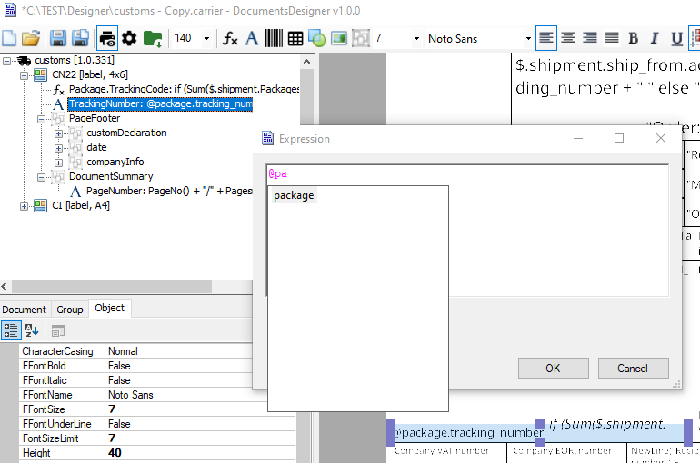

# Document data model

While creating a document template, you can access the data model using JSONPath syntax. You can use both, the dot notation:

```code
$.shipment.tracking_number
```
or the bracket notation:

```code
$['shipment']['tracking_number']
```
## Restrictions:
1. Root element starts from `$.` or `.`
2. Nested object path have to start from `.` If nested object starts from `$.` it means reference to root element. In this case no relation will be considered.
3. The leading `$.` or `.` or `@` is mandatory. One of these has to be used to differentiate variables from JSONPath syntax.  
Special leading char `@` can be used as reference to current object with limited usage that depends on the document type: e.g. for *package* document type we can use `@package` as reference for each package in multi package shipment.
4. Keep in mind that JSONPath functions and filters (expressions) are very limited.
5. Double dots `..property` is not supported.
6. Wildcard for selecting all indexed items `[*]` can be used for arrays only and it means all items in the array.
7. Wildcard for selecting all properties `.*` at object is not supported. e.g. `shipment.*`

## Examples

### Data model
Data model as the source object for JSONPath examples:
```code
{
  "shipment":
  {
    "tracking_number": "US1234",
    "packages": [
      {
        "weight_details":
        {
          "weight_in_grams": "12"
        }
      },
      {
        "weight_details":
        {
          "weight_in_grams": "02"
        }
      }
    ],
    "metadata":
    {
      "account_number": "1234",
      "isBrexit": "true"
    }
  }
}
```

### JSONPath

#### Properties

```code
$.shipment.tracking_number
```

#### Arrays

Items can be referenced by index (starting from zero) or asterisk in the case of aggregation functions.  
```code
$.shipment.packages[0].weight_details.weight_in_grams
Sum($.shipment.packages[*].weight_details.weight_in_grams)
$['shipment']['packages'][0]['weight_details']['weight_in_grams']
```

#### Dictionaries

Generally dot and bracket notation can be used but in case when dictionary key contains dot in key name you have to use bracket notation only.
```code
$.shipment.metadata.isBrexit
$.shipment.metadata['isBrexit']
$.shipment.metadata['account_number']
```

## Table data

When you need to design document with dynamic data rows (e.g. `$.shipment.packages`) it is necessary to use table element.  

In this case data source has to be defined.  

<p>

When you work with table you can specify:

* Item reference

In this case path does not start with `$` but only with dot `.`

* Items range [:n], [1,3,5], [0:2], [-n:], [n:]

Json path elements range is supported as well. E.g. you can select the first n elements of the array or return only selected items if they exist in the array.

### Current package reference

You can use current Package alias using prefix `@`

```code
@package.weight_details.weight_in_grams
```

  
