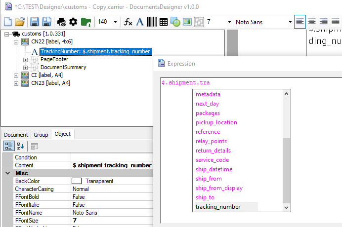

# Data source

While creating a document template, you can access the data model using [JSONPath](https://goessner.net/articles/JsonPath/) syntax. You can use both, the dot notation:

```code
$.shipment.tracking_number
```
or the bracket notation:

```code
$['shipment']['tracking_number']
```
### Restrictions
1. Root element starts from `$.` or `.`
2. Nested object path have to start from `.` If nested object starts from `$.` it means reference to root element. In this case no relation will be considered.
3. The leading `$.` or `.` or `@` is mandatory. One of these has to be used to differentiate variables from JSONPath syntax. 
4. Special leading char `@` can be used as reference to current object with limited usage that depends on the document type, e.g. for *package* document type we can use `@package` as reference for each package in multi package shipment.
5. Keep in mind that JSONPath functions and filters (expressions) are very limited.
6. Double dots `..property` is not supported.
7. Wildcard for selecting all indexed items `[*]` can be used for arrays only and it means all items in the array.
8. Wildcard for selecting all properties `.*` at object is not supported, e.g. `shipment.*`

### Syntax

#### Data source
Data model as the source object for JSONPath examples:
```json
{
  "shipment": {
    "tracking_number": "US1234",
    "packages": [{
      "weight_details": {
        "weight_in_grams": "12"
      }
    },
    {
      "weight_details": {
        "weight_in_grams": "02"
      }
    }],
    "metadata": {
      "account.number": "1234",
      "account_enabled": "true"
    }
  }
}
```

#### Examples

###### Properties

```code
$.shipment.tracking_number
```
&nbsp;



###### Arrays

Items can be referenced by index (starting from zero) or asterisk in the case of aggregation functions.  
```code
$.shipment.packages[0].weight_details.weight_in_grams
Sum($.shipment.packages[*].weight_details.weight_in_grams)
$['shipment']['packages'][0]['weight_details']['weight_in_grams']
```

###### Dictionaries

Generally, a dot and bracket notation can be used, but in case a dictionary key contains a dot, you have to use bracket notation - see the third example.
```code
$.shipment.metadata.account_enabled
$.shipment.metadata['account_enabled']
$.shipment.metadata['account.number']
```

### Table data

When you need to design document with dynamic data rows (e.g. `$.shipment.packages`) it is necessary to use table element.  

In this case *DataSource* has to be defined.  

<p>

When working with a table, you can refer to elements in rows.

* Item reference beginning with dot `.` w/o item name. You cannot use `$.` notation here, as this always reference the root element.

````code
.weight_details.weight_in_grams
````

* Items range. For instance, you can select the first n elements of the array, or return only selected items, if they exist.

````
$.shipment.packages[:n] 
$.shipment.packages[1,3,5] 
$.shipment.packages[0:2] 
$.shipment.packages[-n:]
$.shipment.packages[n:]
````

#### Current package reference

You can also reference to the current *Package* using prefix `@`

```code
@package.weight_details.weight_in_grams
```
&nbsp;


