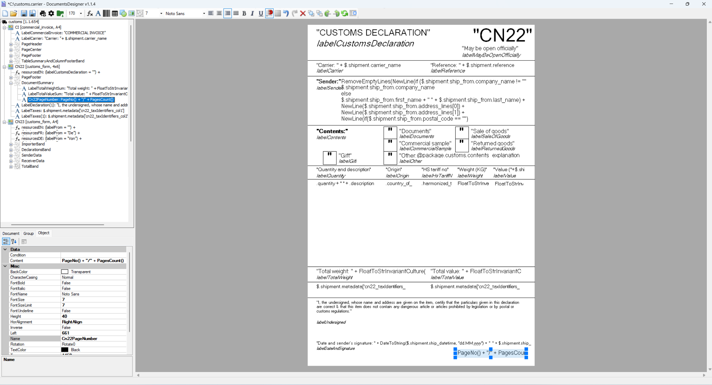
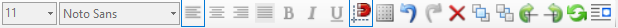
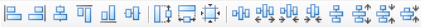
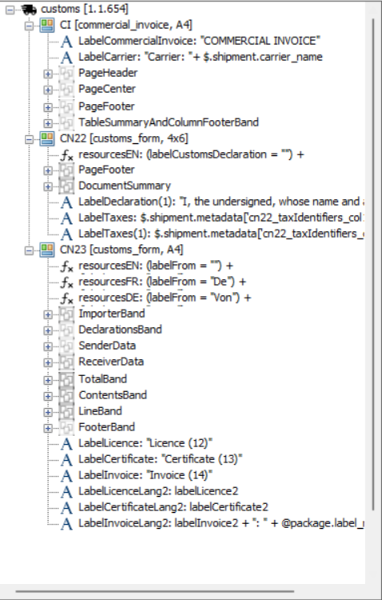
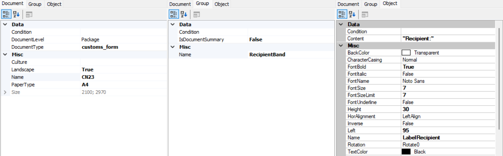

# Designer Window

## Toolbar

### Basic operations section

Contains basic operations on the document:

* **New** - create new blank label
* **Open** - open label from drive
* **Save** - save current carrier
* **Save as** - save as .carrier
* **Preview** - display preview
* **Settings** - sample input data editor
* **Save as** - save as archive .zip (all formats)

### New objects section

Contains actions for adding new objects to the document:

*  **Insert function** - field with function (expression)
*  **Insert text** - field to render fixed text or data model property
*  **Insert barcode** - field to render one of the supported barcodes
*  **Insert table** - logical table containing sections: *Header, Row, Footer*
*  **Insert shape** - field to render rectangles
*  **Insert image** - field to render an image (selected from local drive)
*  **Insert group band** - logical container for rendered objects  

### Settings section

Contains operations and actions directly related to working with the document:

* **Font size** - Size of font in text field(s)
* **Font type** - Font type in text field(s)
* **Left align** - Align text to left in text field(s)
* **Center** - Align text to center in text field(s)
* **Right align** - Align text to right in text field(s)
* **Justify** - Justify text in text field(s) (does'nt work in some of print drivers)
* **Bold** - Set Bold font in text field(s)
* **Italic** - Set Italic font in text field(s)
* **Underline** - Set Underline in text field(s)
* **Snap to grid** - Allows to snap print objects while moving in LD to nearest point of grid (size between grid points is configurable)
* **Show grid** - Show grid in LD
* **Undo** - Undo last change
* **Redo** - Redo last change
* **Remove** - Remove object(s)
* **Bring to front** - Bring object(s) to front
* **Send to back** - Send object(s) to back
* **Rotate clockwise** - Rotate object(s) to right
* **Rotate counterclockwise** - Rotate object(s) to left
* **Refresh properties on mouse move** - Enabling / disabling refreshing properties while moving objects (with this option is possible to avoid some performance issues)
* **Alignment strip** - Open additional menu described below

### Alignment section

Contains all possible alignment options in the document:

* **Align Lefts** - align all selected items to left side of first selected item
* **Align Rights** - align all selected items to right side of first selected item
* **Align Centers** - align all selected items to center of first selected item
* **Align Tops** - align all selected items to top of first selected item
* **Align Bottoms** - align all selected items to bottom of first selected item
* **Align Middles** - align all selected items to middle of first selected item
* **Make Same Height** - set height of all selected items to height of first selected item
* **Make Same Width** - set width of all selected items to width of first selected item
* **Make Same Size** - set size of all selected items to size of first selected item
* **Make Horizontal Spacing Equal** - set horizontal spacing between all selected items equal
* **Increse Horizontal Spacing** - increase horizontal spacing between all selected items
* **Decrease Horizontal Spacing** - decrease horizontal spacing between all selected items
* **Remove Horizontal Spacing** - remove horizontal spacing between all selected items
* **Make Vertical Spacing Equal** - set vertical spacing between all selected items equal
* **Increase Vertical Spacing** - increase vertical spacing between all selected items
* **Decrease Vertical Spacing** - decrease vertical spacing between all selected items
* **Remove Vertical Spacing** - remove vertical spacing between all selected items

### Tree view tab

This view shows the full structure of objects on a given document and other documents. 

### Properties tab

Includes 3 sections:

* **Document** - Properties of the whole document
* **Group** - Properties of a selected group of objects
* **Print object(s)** - Properties of a single object
