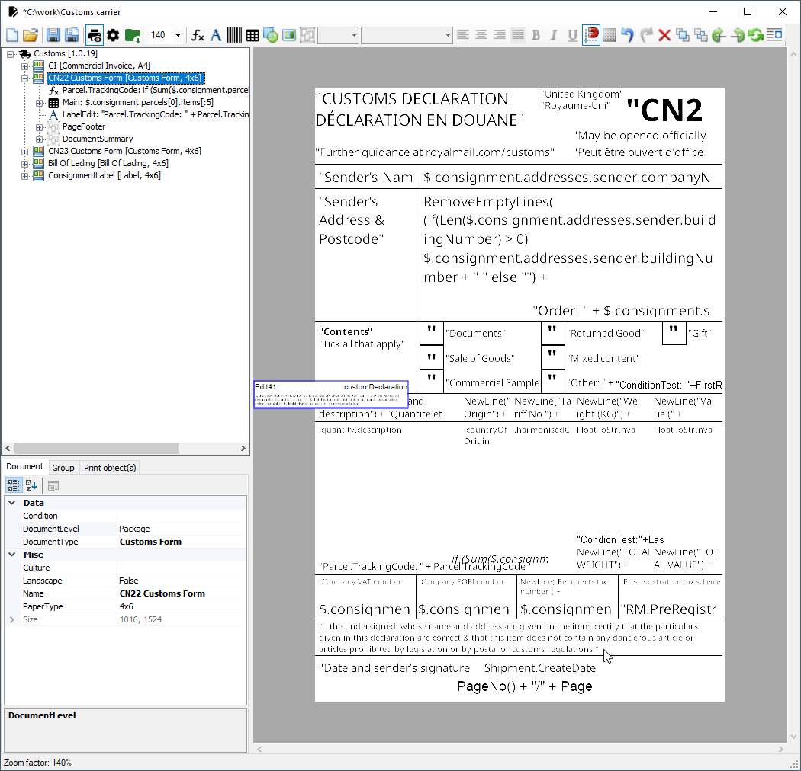

# Designer Window

## Toolbar

*  **Insert function** - field with function (expression)
*  **Insert text** - field to render fixed text or data model property
*  **Insert barcode** - field to render one of the supported barcodes
*  **Insert table** - logical table containing sections: *Header, Row, Footer*
*  **Insert shape** - field to render rectangles
*  **Insert image** - field to render an image (selected from local drive)
*  **Insert group band** - logical container for rendered objects  

## Functions

| **Function**     | **Example**                                     | **Description**                                                                                                            |
|------------------|-------------------------------------------------|----------------------------------------------------------------------------------------------------------------------------|
| Ceiling          | _Ceiling(double)_                               | Returns the smallest integral value that is greater than or equal to the specified double-precision floating-point number. |
| DateDayOfWeekNo  | _DateDayOfWeekNo(DateTime)_                     | Returns day number where 0 is Sunday, 1 is Monday and the rest is as follow.                                               |
| DateToString     | _DateToString(date, format)_                    | Converts DateTime to String using the indicated format. The format is a standard [format string](https://learn.microsoft.com/en-us/dotnet/standard/base-types/standard-date-and-time-format-strings).                            |
| FloatToStr       | _FloatToStr(number, format)_                    | Returns the numeric value formatted acc. to the format template                                                            |
| Floor            | _Floor(double)_                                 | Returns the largest integral value less than or equal to the specified double-precision floating-point number.             |
| IndexOf          | _IndexOf(text, startIndex, searchedPartOfText)_ | Reports the zero-based index of the first occurrence of the specified string. In case of not finding it returns -1         |
| Len              | _Len(arg)_                                      | Returns the text length                                                                                                    |
| NewLine          | _NewLine(text)_                                 | Add new line after text                                                                                                    |
| Now              | _Now()_                                         | Returns the current date and time                                                                                          |
| RemoveEmptyLines | _RemoveEmptyLines(text)_                        | Remove empty lines in provided string                                                                                      |
| Round            | _Round(number, decimals)_                       | Returns the value number rounded to the number of decimal places specified by decimals                                     |
| RowsCount        | _RowsCount()_                                   | Returns the number of rows                                                                                                 |
| StrReplace       | _StrReplace(text,from,to)_                      | Returns text where from is replaced with to                                                                                |
| StrToDate        | _StrToDate(text, exactFormat)_                  | Returns the date and time as text acc. to exactFormat                                                                      |
| StrToFloat       | _StrToFloat(text)_                              | Converts String to Numeric                                                                                                 |
| StrToLower       | _StrToLower(text)_                              | Returns text in lower case                                                                                                 |
| StrToUpper       | _StrToUpper(text)_                              | Returns text in upper case                                                                                                 |
| StrTrim          | _StrTrim(text)_                                 | Removes all leading and trailing white-space characters from the provided string.                                          |
| SubStr           | _Substr(text,start,len)_                        | Returns a text fragment                                                                                                    |

