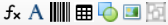

# Designer Window

## Toolbar

*  **Insert function** - field with function (expression)
*  **Insert text** - field to render fixed text or data model property
*  **Insert barcode** - field to render one of the supported barcodes
*  **Insert table** - logical table containing sections: *Header, Row, Footer*
*  **Insert shape** - field to render rectangles
*  **Insert image** - field to render an image (selected from local drive)
*  **Insert group band** - logical container for rendered objects

## Functions
