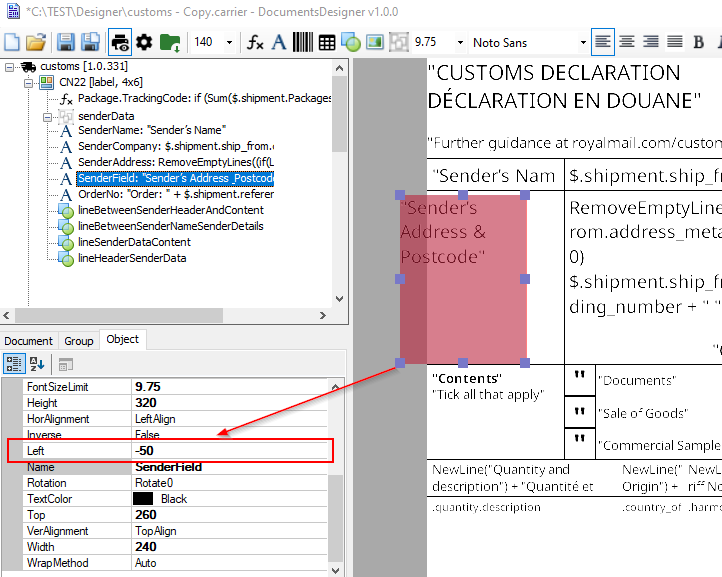

# TypeScript Library

## How to enable syntax suggestions in formula editor?
Please use Ctrl + space.

## Why some print objects in design are mark as red?
Printed object is marked as red in the design view when it is located outside the printable page area.


## How to generate proper page counts for multi page documents?
Pages count is now after all document precalculation. 
It is why proper value can be rendered only for print object put on Group band with IsDocumentSummary=true property.

## How to calculate whole document summary on first page?
If there is the need to include some summary data on first page for multi page document (e.g. total weight)
than Group band with `IsDocumentSummary=true` property must be used.

## Why property IsDocumentSummary set to true doesn’t work on table’s child group?
It works and should be use only for whole document. For tables Footer and Header group should be used instead.

## How to handle current package data in Package document type?
You can use package alias syntax:
```code
@package.weight
```

## Why current package reference does not work?
Package reference `@package` works only for `Package` document type

## Why is one document rendered to few documents?
When multi page document is rendered to png format then every rendered page is return as single document with page number in document name.
