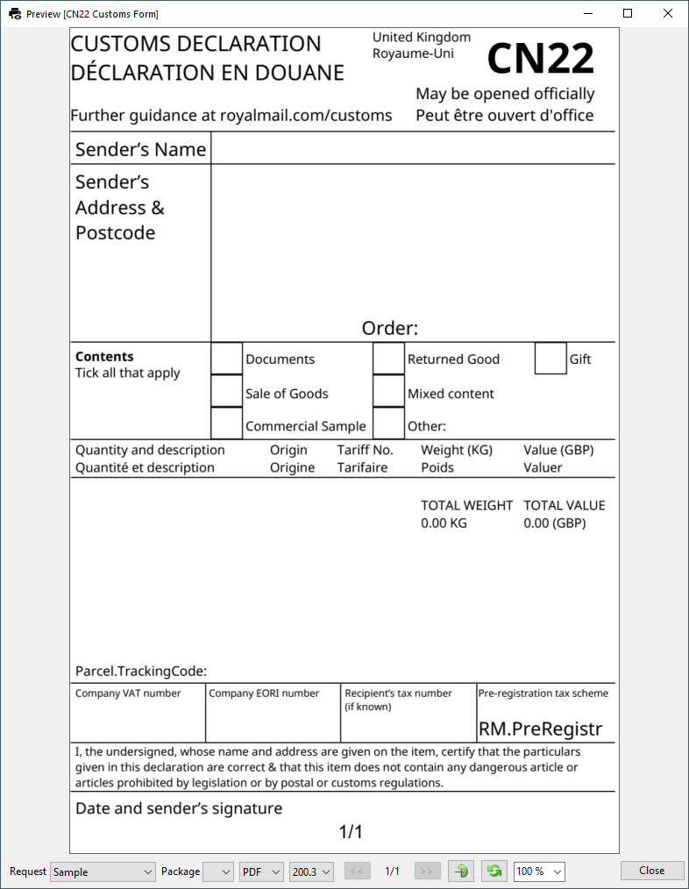
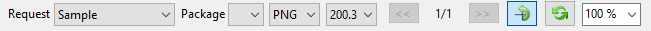

# Document preview

### Toolbar

#### Request

An expandable list that gives you options for selecting pre-written sample requests in the Sample input data editor (Settings).

#### Package

The package indicated by the index in the sample request data for which the document preview is rendered.

#### Format

The list contains formats at which we want to render the document preview.

#### Dpi

The list contains the dpi values at which we want to render the document preview.

####  Zoom
You can zoom preview by using drop down [100%] or using *Ctrl + Mouse Wheel*.

#### Rotation
For landscape documents it can be convenient to rotate the view. It has impact only on preview.

####  Refresh
Document preview is refreshed automatically after each change on design or preview option, e.g. request data, format, dpi. You can manually force the refresh.

#### Page number

When rendered document is multi-page (e.g. Pdf), you can choose the one you want to preview.  
