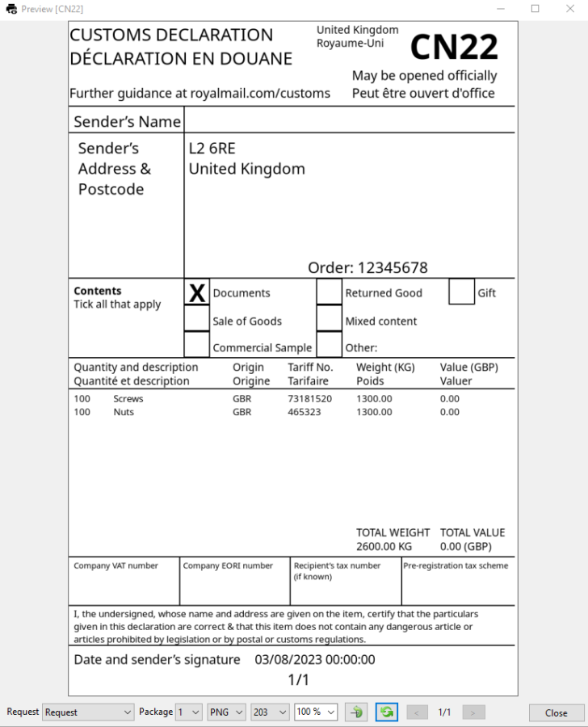

# Preview Window

## Toolbar

### Request

An expandable list that gives you options for selecting pre-written sample requests in the Sample input data editor (Settings).

### Parcel

The parcel indicated by the index in the sample request data for which the document preview is rendered.

### Format

A list of formats that can be selected to render the document preview.

### DPI

The list contains the dpi values at which we want to render the document preview.

### Page number

When rendered document is multi pages (e.g. PDF), here you can choose the one you want to preview.

### Rotation
For landscape documents it can be convenient to rotate the view. It has impact only on preview.

###  Refresh
Document preview is refreshed automatically after each chnage on design or previed options (dpi, format, request data) change. Here you can manually force the refresh.

###  Zoom
You can zoom preview by using drop down (100%) or using Ctrl + mouse scroll.  