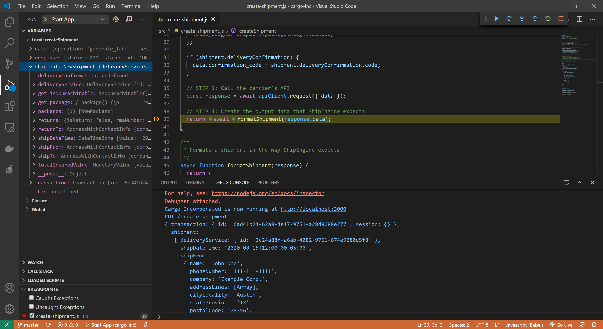
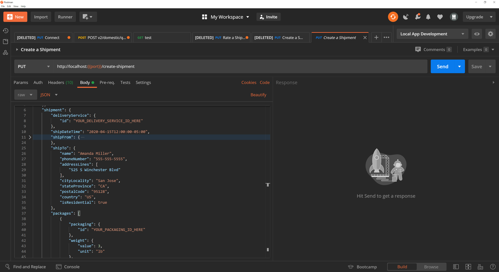
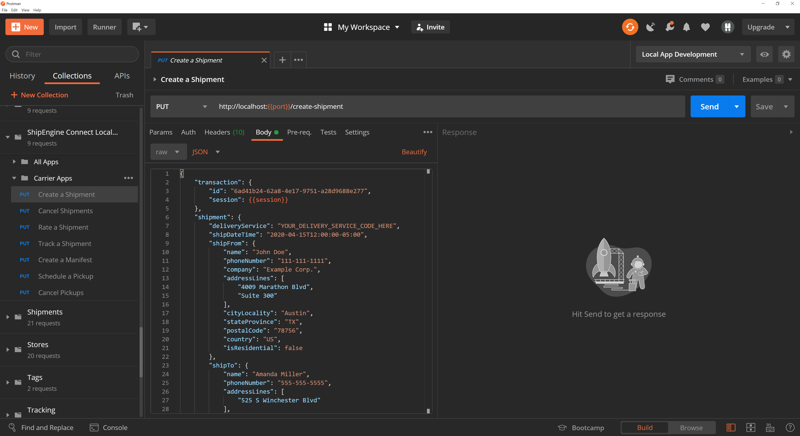
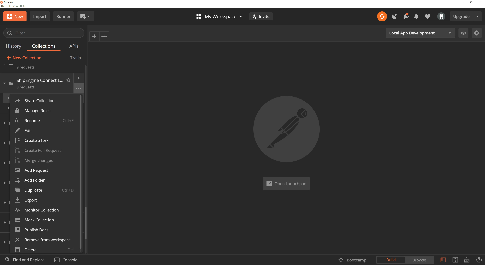
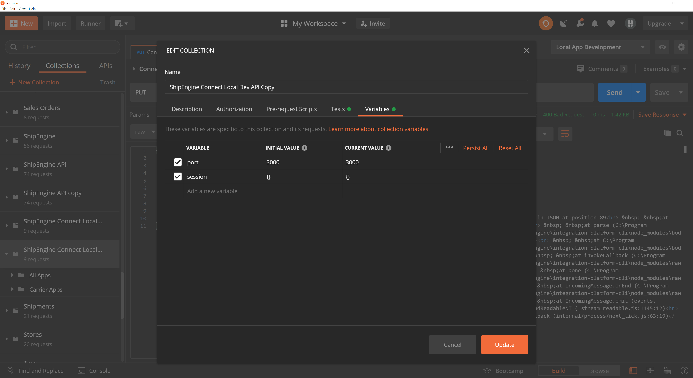
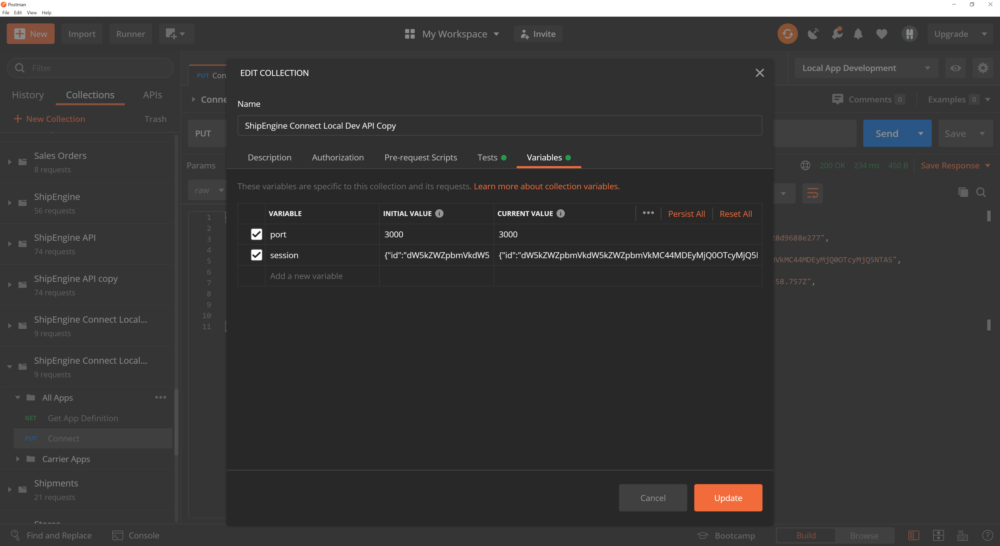
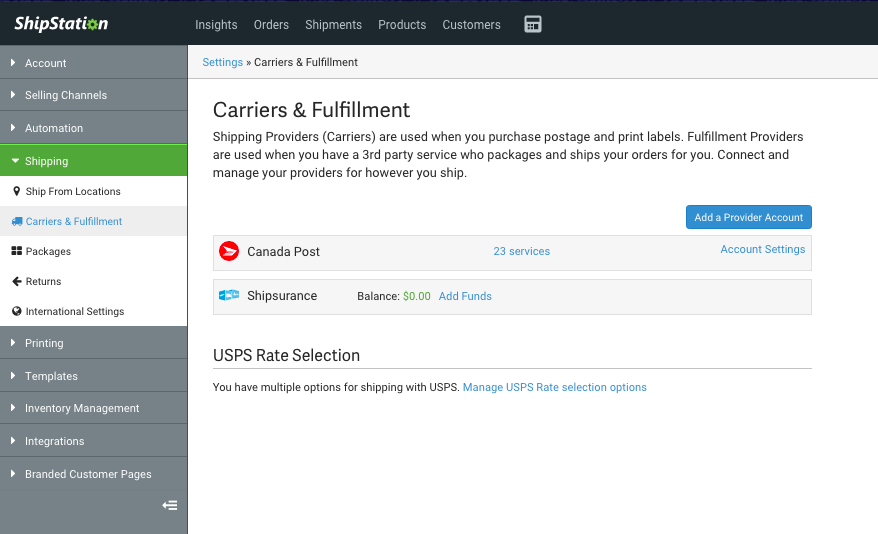

import Pager from "../../components/pager";


Testing Your Application
=============================
While developing your application, it's important to run tests to verify that your project structure is in the correct format and that your code behaves as expected.

There are multiple ways to test your application, and we suggest taking advantage of all of them to ensure the highest quality integration.

Local Testing
-----------------------------

[The `connect start` command](./../cli.md#run-your-app-locally) starts a local server that allows you to invoke your app's methods using [our Postman collection](https://documenter.getpostman.com/view/12340335/T1LPBRJk?version=latest). The server monitors your source code and automatically reloads your app whenever changes are detected, so if you find a bug, you can fix it and immediately retry.

<p>
  Click the <b>Run in Postman</b> button to open our collection directly in Postman: &nbsp;&nbsp;
  <span className="postman-run-button" data-postman-action="collection/import" data-postman-var-1="12340335-39b1c68e-b79c-4d34-9512-ca9a7cdf1341-T1LPBRJk" data-postman-var-2="latest" style="vertical-align: middle"></span>

  <script type="text/javascript">
    (function (p,o,s,t,m,a,n) {
      !p[s] && (p[s] = function () { (p[t] || (p[t] = [])).push(arguments); });
      !o.getElementById(s+t) && o.getElementsByTagName("head")[0].appendChild((
        (n = o.createElement("script")),
        (n.id = s+t), (n.async = 1), (n.src = m), n
      ));
    }(window, document, "_pm", "PostmanRunObject", "https://run.pstmn.io/button.js"));
  </script>

> **PRO TIP:** You can use the [VSCode debugger](https://code.visualstudio.com/docs/editor/debugging) to set breakpoints, step through your code line-by-line, and inspect variables at runtime. Just press `F5` to start a debug session.




### Request Modification
Each request in [our Postman collection](https://documenter.getpostman.com/view/12340335/T1LPBRJk?version=latest) contains sample data that matches the structure expected by one of the methods in your application. We have included placeholder text
in the areas where you will need to provide values.

For example, when running the `Create a shipment` request in the `Carrier Apps` folder, you will need to provide IDs for
`shipment.delivery_service.id` and `shipment.packages[].packaging.id` that are defined in your application.

You may also need to modify the `shipFrom` and `shipTo` properties
to addresses within your service area and ensure that the `shipDateTime` is in the future.

Note that you will likely need to update the properties in the `Connect` request to match the names you used in your [connection form](./../reference/forms.md#connection-form-examples).

You can begin running requests in this collection as soon as you have defined the corresponding method, even if it is not fully implemented.
It may be useful to set a breakpoint and examine the structure of the data sent to your method to assist in mapping the input
data to the format expected by your backend service or API.




### Authentication

You may have noticed that each request in our Postman collection contains a `transaction` object that contains a `session` property.
Once you are ready for your method to call your backend API or service, you will need to specify authentication information.

#### Postman Variables
Our Postman collection uses variables to persist session data between requests. You can see in the request below that we set the `transaction.session`
property to `{{session}}`. This is the way Postman variables are referenced within request payloads. While it is not valid
JSON at the moment, it will be once Postman renders the request.




You can see and set the value of the variables by editing the collection. Click the ellipses icon next to the collection name
and select `Edit`, then click the `Variables` tab.




When you first import the collection, the `session`
variable will be unset.




When beginning to work with our Postman collection, you should first run the `Connect` request in the `All Apps` folder with valid credentials to create a session. This will then set the `session` variable that is referenced in each of the other requests. Likewise, if you already
have a valid session you wish to use, you can edit the variable directly and skip running the `Connect` request.




#### Hardcoded Values
You may wish to hardcode the session data in each of your requests rather than using Postman variables. If so, you will need to run the `Connect`
request with valid credentials and then copy the `transaction.session` value that is returned and update each Postman request to use this value.
Likewise, if you already have a valid session you wish to use, you can skip running the `Connect` request and add the
`session` data directly to the request.


Automated Testing
-----------------------------
[The `connect test` command](./../cli.md#test-your-app) validates your application against our test suite. These tests are integration tests that represent real world, end-to-end scenarios.
Rather than calling a single, individual method, these tests may make calls to multiple method in order to construct a more realistic workflow.


For example, to cancel a shipment an end user interacting with your application would need to authenticate and create a shipment before cancelling it. Therefore a
single test may authenticate by calling your [`connect`](./../reference/methods/connect.md) method, create a shipment using your
[`createShipment`](./../reference/methods/create-shipment.md) method, and then use your [`cancelShipments`](./../reference/methods/cancel-shipments.md) method to
cancel the shipment.

These tests execute the entire application, so you won't be able to run this suite until you have finished implementing all the methods
in your application. For this reason, we recommend using the `connect start` command to perform testing during iterative development.

Once you have completed development,
this test suite can provide a higher degree of confidence that the application will work as expected when used from within one of our
e-commerce applications since this suite calls your application in the same manner in which it will be used in production.

> *TIP*
> You can find a breakdown of tests available for the Carrier App [here](./carrier-app-tests.md).


Unit Testing
-----------------------------
We recommend that in addition to local and automated tests, we recommend that you also you write unit tests for your application. We don't include any
tooling or impose any restrictions on which tools you can use for writing unit tests. You are free to use any JavaScript tools you are comfortable with,
such as these:

#### [Jest](https://jestjs.io/)
Jest is a batteries-included, zero-configuration test runner that is approachable for beginners, extensible for almost all testing use cases and scalable to large projects.
It includes the test runner, an assertion library, and extensible matchers - everything you need to being writing unit tests.

#### [Mocha](https://mochajs.org/)
Mocha is a feature-rich JavaScript test framework running on Node.js and in the browser. Mocha tests run serially, allowing for flexible and accurate reporting, while mapping uncaught exceptions to the correct test cases.

#### [Chai](https://www.chaijs.com/)
Chai is a Business Driven Development (BDD) / Test Driven Development (TDD) assertion library for node and the browser that can be depaired with any javascript testing framework, such as Mocha.

#### [Sinon](https://sinonjs.org/)
Sinon is a standalone tool that provides test spies, stubs and mocks for JavaScript and works with any unit testing framework.

#### [Nock](https://github.com/nock/nock)
Nock is an HTTP server mocking and expectations library for Node.js. It can be used to test modules that perform HTTP requests in isolation. This can be useful
in mocking out your backend API for unit testing.

### Example
Here's an example unit test suite using [Mocha](https://mochajs.org/) and [Chai](https://www.chaijs.com/) to test [the `createShipment` method](./../reference/methods/create-shipment.md).

> **NOTE:** When creating mock parameters for your methods, you only need to populate the properties that you actually use in your code

```javascript
const createShipment = require("../src/methods/create-shipment.js");
const { expect } = require("chai");

describe("createShipment test suite", () => {
  let transaction, shipmentCriteria;

  beforeEach("Create mock parameters", () => {
    transaction = {
      id: "e62eff07-a9f6-4075-80d1-ca4ab788a6fe",
      session: {
        token: "cj8Aro60dfa4abe62erQ07"
      }
    };

    shipmentCriteria = {
      deliveryService: { code: "NXT_DAY" },
      deliveryConfirmatmion: { code: "SIG" },
      shipFrom: {
        name: { given: "John", family: "Doe" },
        addressLines: ["4009 Marathon Blvd"],
        cityLocality: "Austin",
        stateProvince: "TX",
        postalCode: "78756",
        country: "US"
      },
      shipTo: {
        name: { given: "Amanda", family: "Miller" },
        addressLines: ["525 S Winchester Blvd"],
        cityLocality: "San Jose",
        stateProvince: "CA",
        postalCode: "95128",
        country: "US"
      },
      packages: [{
        packaging: { code: "BOX" },
        weight: { ounces: 36 },
        label: {
          format: "pdf",
          size: "4x6"
        }
      }]
    };
  });

  it("should create a shipment without insurance", async () => {
    let shipment = await createShipment(transaction, shipmentCriteria);

    expect(shipment).to.be.an("object");
    expect(shipment.deliveryDateTime).to.be.an.instanceOf(Date);
    expect(shipment.charges).to.be.an("array").with.lengthOf(1);
    expect(shipment.charges[0].type).to.equal("delivery");
    expect(shipment.charges[0].name).to.equal("Delivery Charge");
  });

  it("should create a shipment with insurance", async () => {
    shipmentCriteria.packages[0].insuredValue = { value: 500, currency: "USD" };
    let shipment = await createShipment(transaction, shipmentCriteria);

    expect(shipment).to.be.an("object");
    expect(shipment.deliveryDateTime).to.be.an.instanceOf(Date);
    expect(shipment.charges).to.be.an("array").with.lengthOf(2);
    expect(shipment.charges[0].type).to.equal("delivery");
    expect(shipment.charges[0].name).to.equal("Delivery Charge");
    expect(shipment.charges[1].type).to.equal("insurance");
    expect(shipment.charges[1].name).to.equal("Insurance Cost");
    expect(shipment.packages[0].metadata.isInsured).to.equal(true);
  });
});
```


Live Testing
-----------------------------
Once you have completed local development and testing of your application, you can then [publish](./../publish.md) your app to
our development platform where you can perform live testing through one of our e-commerce applications, such as
[ShipStation](https://www.shipstation.com/), before it is promoted to our production platform.




<Pager prev="./../sandbox.md" prevTitle="Sandbox Environments" next="./../publish.md" nextTitle="Publishing" />
