# Testing Guide

The purpose of a ShipEngine Connect shipping integration is to integrate your carrier with our many e-commerce
solutions, so it is important to see how your app behaves when running in one of these applications.

This guide describes the steps required to access and test your app within
[ShipStation](http://www.shipstation.com). Your shipping integration running in ShipEngine Connect makes it possible for ShipStation to
offer your carrier as a shipping option to online sellers who use ShipStation to manage and ship online orders.

## Logging in to ShipStation
When you publish your app to ShipEngine Connect, a URL and set of credentials will be displayed on the console
once the publishing process completes. You can use this URL to access a ShipStation staging environment where you can
login with the provided credentials and execute the test scenarios described below.

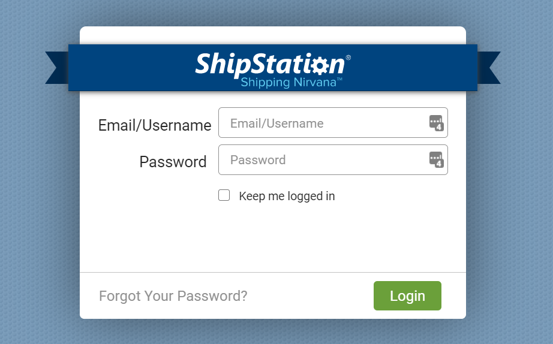

## Setting up a Carrier
Once you login to ShipStation, you will interact with your app by setting up a carrier.
ShipStation ties each of its users, referred to as sellers, to a home country. Your carrier will only be visible to sellers who have a home
country within the countries you operate. Once you publish your app, a seller account will be generated in each country
in which your carrier operates.
For optimal coverage, each of the test scenarios in this guide should be executed as a seller in each
country the carrier supports.

The steps below will guide you in connecting a carrier using your app.
You can refer to our [quick start guide](https://help.shipstation.com/hc/en-us/articles/360026151511-Quickstart-Account-Setup)
for more information.

Be sure to add a [Ship From location](https://help.shipstation.com/hc/en-us/articles/360026157571-Set-Ship-From-Return-Address) as this will be required to create a label.

:::success Info
These tests exercise your [`Register` method](../reference/operation/Register) and your
connection form.
:::

1. Expand the **_Shipping_** option in the left navigation.
2. Click **_Carriers & Fulfillments_**
3. Click the **_Add a Provider Account_** button.
4. You will see a modal similar to the one below. Locate your carrier’s logo in the modal and verify that it looks
correct. Click on the logo to access your app's connection form.

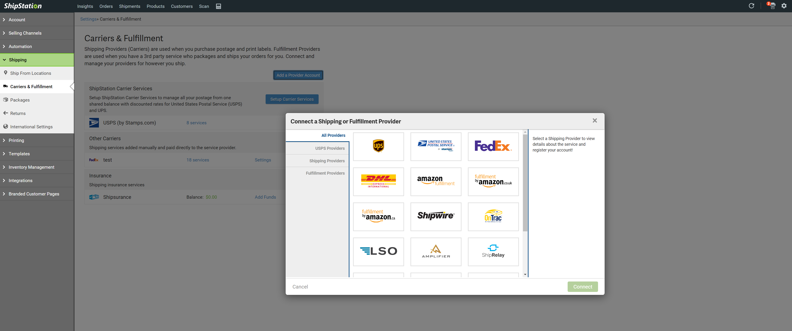

5. Verify that you can create a new connection to your carrier by entering valid credentials in the connection form.
6. Verify that a failed authentication is handled cleanly by entering invalid credentials into your connection form.
7. Verify that an appropriate error is displayed if you try to create a second connection using the same credentials as an existing connection.
8. Verify that you can create multiple connections for your carrier using different sets of credentials.
9. Verify that you can remove the carrier from the Settings page. To access the Settings page, click the gear icon in the upper right corner.
10. Create a connection to your carrier using valid credentials before moving on the next set of tests.

## Testing in the Order Grid
Now that you have authenticated with your carrier's API, you can begin performing actions in the ShipStation UI that
exercise your methods.

:::success Info
These tests validate that your definitions were processed correctly
and that all your metadata appears as expected when viewed through ShipStation.
:::

The following test scenarios access your app's functionality through the order grid view in ShipStation.
These scenarios test that the
services and options specified in your definition files are displayed properly in ShipStation. Before you can access
these features, you will need to create a [manual order](https://help.shipstation.com/hc/en-us/articles/360035969692-Manual-Orders).
Once you create the order and click the Save button, you will be taken to a screen similar to the screenshot below.

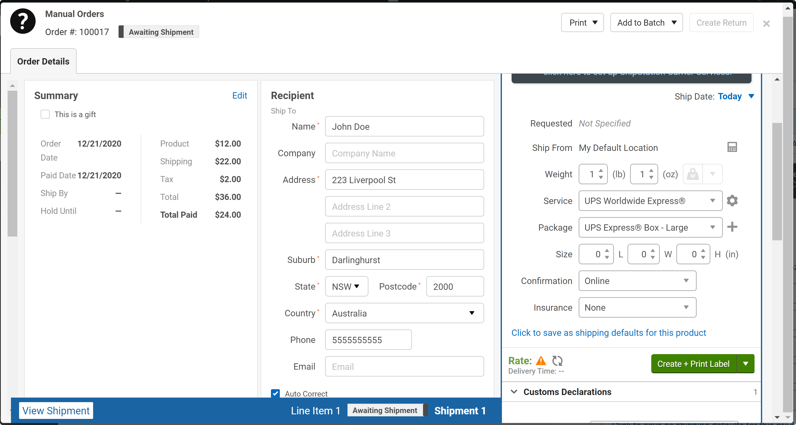

### Validate Definitions
1. Inspect the **_Service_** drop-down, and verify that all your delivery services are listed as expected.
2. Inspect the **_Package_** drop-down, and verify that all your packages are listed as expected.
3. Inspect the **_Confirm_** drop-down, and verify that all your delivery confirmations are listed correctly.

### Validate Error Handling

:::success Info
These tests exercise your [`GetRates` method](../reference/operation/Get%20Rates).
:::

This page gets new rates as you make changes to the shipment details. You can refresh the rate information that
is displayed by clicking the refresh button circled in red in the screenshot below. On this screen, you can enter
invalid weights and sizes, given the other selected criteria, to test the flow of errors, whether they are coming
from your backend API or from validation from within your app. If there is an error, you will see the orange triangle
circled in green. If you hover over the orange triangle, you will see any errors associated with the rate.
This is a great way to test that your business use cases are handled correctly.

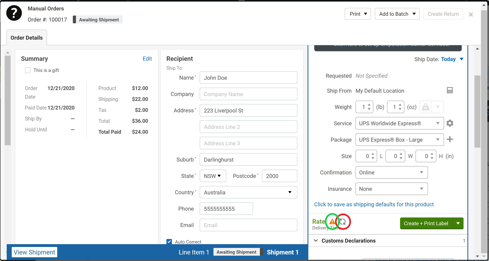

You can validate many aspects of your app from this screen. You should run through the steps above with both a domestic
and an international address, if your app supports international shipments. For international shipments, be sure to test
all the Customs Declarations fields as well. For optimal coverage, you should test each of these as a seller from each
country supported by the carrier.

### Create Labels

:::success Info
These tests exercise your [`CreateLabel` method](../reference/operation/Create%20a%20Label).
:::

1. Create a manual order for a domestic shipment.
2. Click the Create + Print Label button.
3. Click the Download button to download the label
4. Open the downloaded file and verify that all parts of the label are accurate.

You should repeat the steps above for the following cases:
1. A domestic shipment that includes multiple packages. Click the + button next to the Packages drop-down box to add another package to the shipment.
2. An International shipment.
3. An international shipment that includes multiple packages.

## Testing in the Rate Calculator

:::success Info 
These tests execute your [`GetRates` method](../reference/operation/Get%20Rates).
:::

You should validate that your app performs properly when getting rates from the rate calculator in the toolbar.
Note that this functionality is not supported for some shipping integrations. If your carrier’s backend API call to retrieve
rates requires a full address, you will not be able to get rates from the carrier using the rate calculator.

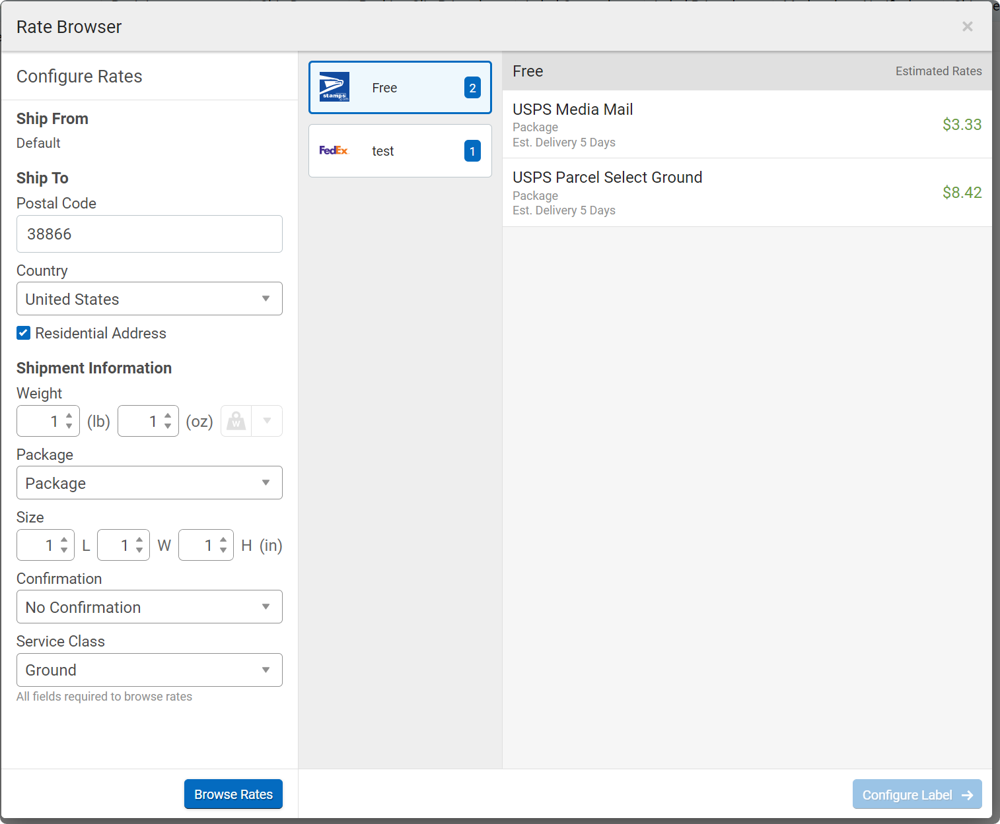

### Validate Definitions
:::success Info
These tests validate that your definitions were processed correctly
and that all your metadata appears as expected when viewed through ShipStation.
:::

1. Inspect the **_Package_** drop-down, and verify that all your packages are listed as expected.
2. Inspect the **_Confirmation_** drop-down, and verify that all your delivery confirmations are listed correctly.

### Validate Rates
:::success Info
These tests exercise your [`GetRates` method](../reference/operation/Get%20Rates).
:::

Clicking the **_Browse Rates_** button in the rate calculator makes a call to your `rateShipment` method. In this
screen, it is useful to change the rate criteria and verify that the rates returned when you click the **_Browse Rates_**
button are accurate for the given criteria. This is especially useful if your method has to filter out the rates
that don't match the specified criteria.

### Create Labels
:::success Info
These tests exercise your [`CreateLabel` method](../reference/operation/Create%20a%20Label).
:::

1. Enter rate criteria that matches a rate provided by your carrier.
2. Click the **_Browse Rates_** button
3. Select a rate for your carrier
4. Click the **_Configure Label_**  button. You will see the screen below, which is very similar to the one displayed
after you created a new manual order. It is a good idea to verify all your services in this view as well.

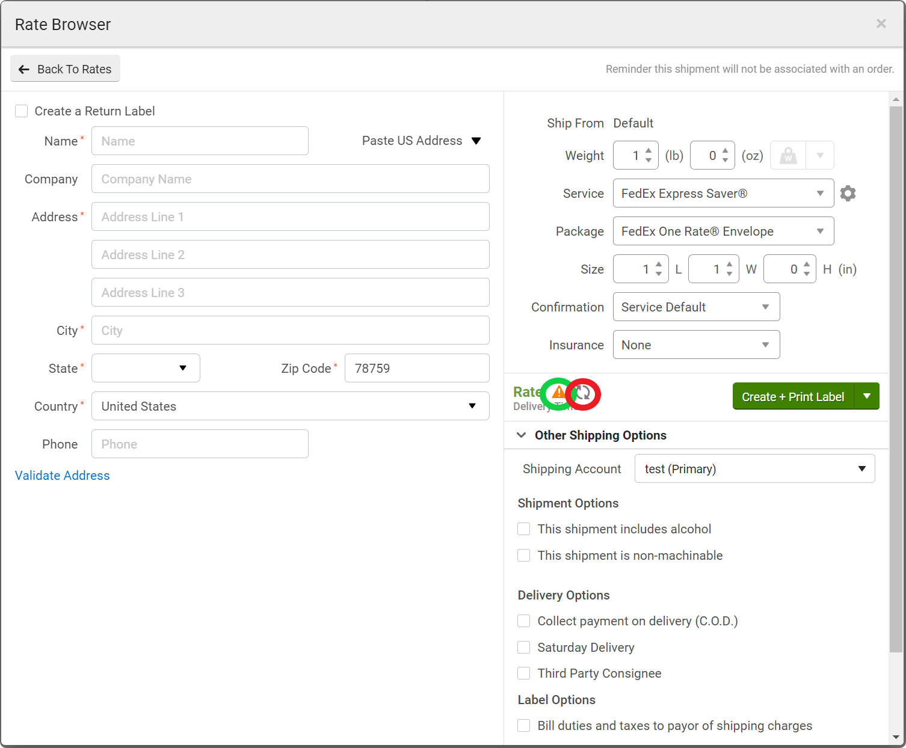

5. Enter a valid domestic address.
6. Enter valid values for the label properties in the right-hand pane.
7. Click the **_Create + Print Label_** button. You will see a screen similar to the one below.

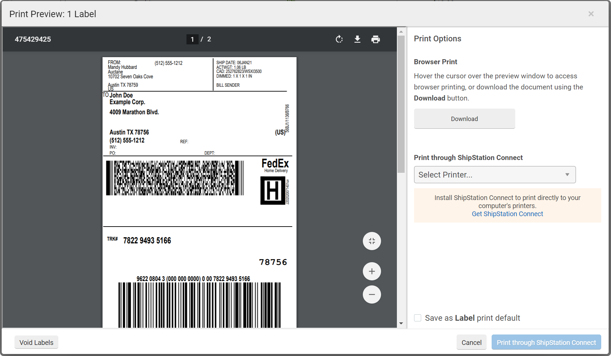

8. Click the **_Download_** button to download the label.
8. Open the downloaded file and verify that all parts of the label are accurate.
9. Repeat the steps above with an international address.

## Voiding Labels
:::success Info
These tests exercise your [`VoidLabels` method](../reference/operation/Void%20a%20Label).
:::

If you have run through the tests above, you should now have several shipments available in the shipments grid in
ShipStation. Click the **_Shipments_** tab in at the top of screen to access the list of labels, or shipments, you have
created.

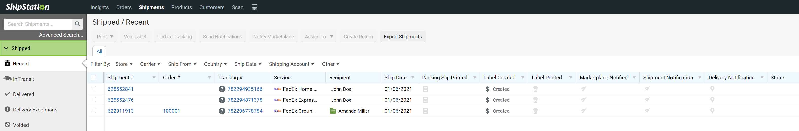

1. Click the box to select a label.
2. Click the **_Void Label_** button.
3. Verify that the operation completes successfully. You should see a dialog similar to the following.

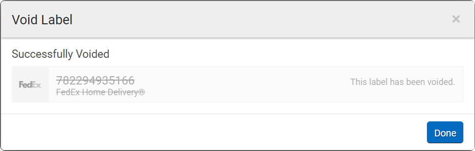

4. Click the **_Done**_ button to dismiss the dialog and return to the shipment grid.
5. Select multiple labels.
5. Click the **_Void Label_** button.
6. Verify that the operation completes successfully.

## Tracking Shipments
:::success Info
These tests exercise your [`Track` method](../reference/operation/Track%20a%20Shipment).
:::

## Getting Tracking Info

1. [Create a label](https://help.shipstation.com/hc/en-us/articles/360026157651-Create-Single-Labels).
if you have voided all the ones you created in previous tests.
2. Go to the Shipments tab, underlined in green in the screenshot below.
3. Click on a tracking number for one of your shipments, underlined in red in the screenshot below.
4. Verify that clicking the tracking number takes you to a valid tracking page for your carrier.
This test validates the `TrackingUrl` property in your shipping integration definition

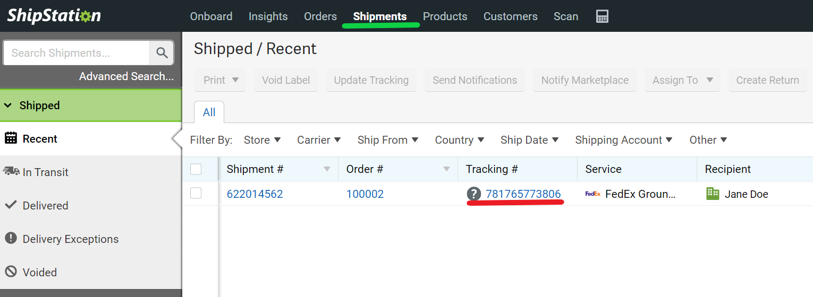

## Updating Tracking

1. [Create a label](https://help.shipstation.com/hc/en-us/articles/360026157651-Create-Single-Labels).
if you have voided all the ones you created in previous tests.
2. Go to the Shipments tab, underlined in green in the screenshot below.
3. Select the shipment for which you just created a label by clicking the checkbox next to it.
4. Click the **_Update Tracking_** button, circled in red in the screenshot below. This will call your `Track` method.
If the status has changed in your backend system since you created the label, you should see it updated in the UI.
5. Verify that no errors are displayed.

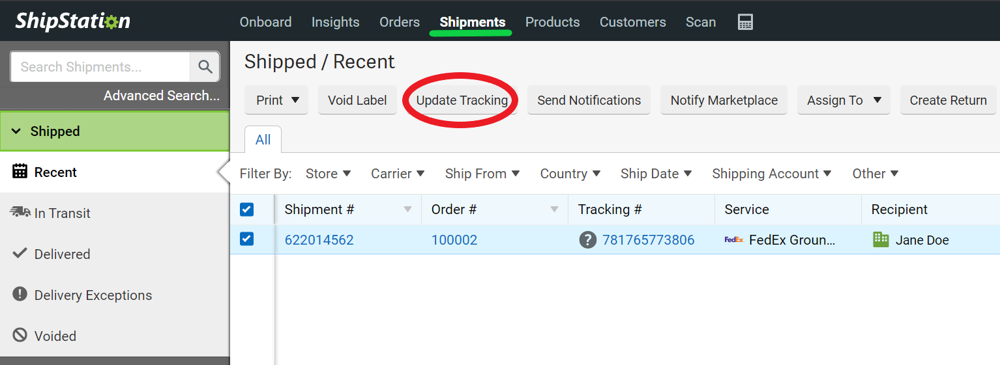

6. Select multiple labels. You may need to [create additional labels](https://help.shipstation.com/hc/en-us/articles/360026157651-Create-Single-Labels).
7. Click the **_Update Tracking_** button. The status should be updated if it has changed in your backend system.
8. Verify that no errors are displayed.

## Scheduling a Pickup
:::success Info
These tests exercise your [`SchedulePickup` method](../reference/operation/Schedule%20Adhoc%20Pickup).
:::

1. [Create a label](https://help.shipstation.com/hc/en-us/articles/360026157651-Create-Single-Labels)
if you have voided all the ones you created in previous tests.
2. Go to the Shipment tab.
2. Click the **_Carrier Pickups_** tab in the left-hand nav, which is highlighted in green in the screen shot below.

3. Select your carrier from the blue **_Schedule a Pickup_** drop-down. You will see a dialog similar to the following.

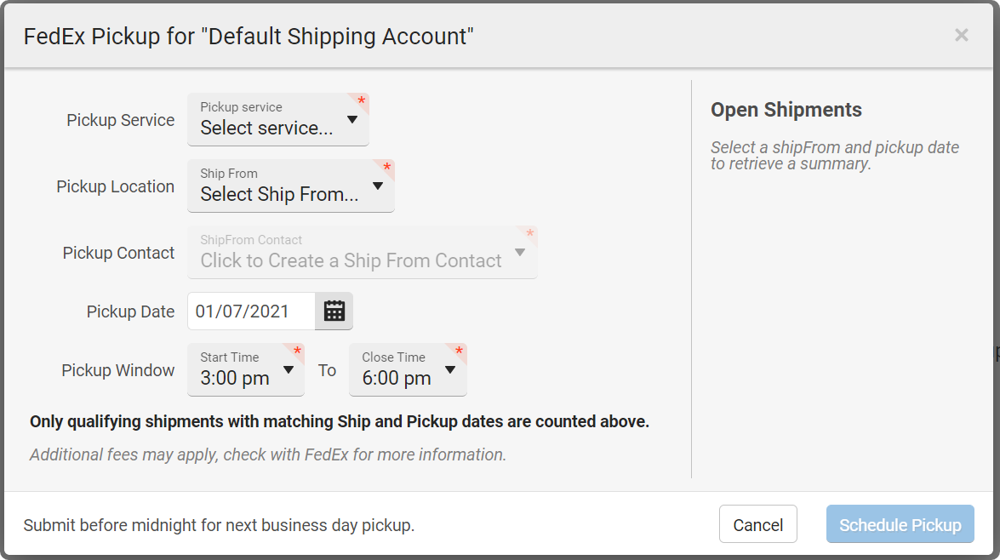

4. Select valid values in each of the drop-down boxes. If you have open shipments that meet the criteria, they will
be displayed in the right-hand pane under **_Open Shipments_**. You will need to ensure that you have applicable shipments
before you can schedule a pickup.

:::success Info
The Pickup Date will default to the next day so you might not see any Open Shipments listed until you modify
the Pickup Date to the current date.
:::

5. Once you you have selected criteria that populates the **_Open Shipments_** pane, click the **_Schedule a Pickup_** button.
It will be enabled once you have selected the criteria.
6. Verify that no errors are displayed.
7. Verify that your pickup is displayed in the carrier pickups grid.
Schedule a pickup for the shipment for which you just created.

## Canceling a Pickup
:::success Info
These tests exercise your [`CancelPickup` method](../reference/operation/Cancel%20Adhoc%20Pickup).
:::

At this point, you should have a pickup scheduled that is available to cancel.

1. From the carrier pickups grid, select the pickup you scheduled in the previous test.
2. Click the **_Cancel Pickup_** button.
3. Verify that no errors are displayed.
4. Verify that the pickup no longer appears in the carrier pickups grid.

## Creating a Manifest
:::success Info
These tests exercise your [`CreateManifest` method](../reference/operation/Create%20Manifest).
:::

A manifest, also known as a SCAN form or end-of-day form, allows you to provide the carrier with a single form that can
be scanned to input all your shipments into the carrier's system at once. Before you can create a manifest, you must
have labels that were created on the current business day.

1. [Create a few labels](https://help.shipstation.com/hc/en-us/articles/360026157651-Create-Single-Labels).
2. Navigate to the shipments grid by clicking the **_Shipments_** tab at the top of the screen.
3. Once on the shipments grid, click the _**End of Day**_ tab in the left-hand nav. You should see a screen similar to
the one below that lists your carrier's name and the number of labels you have created for the current business day.

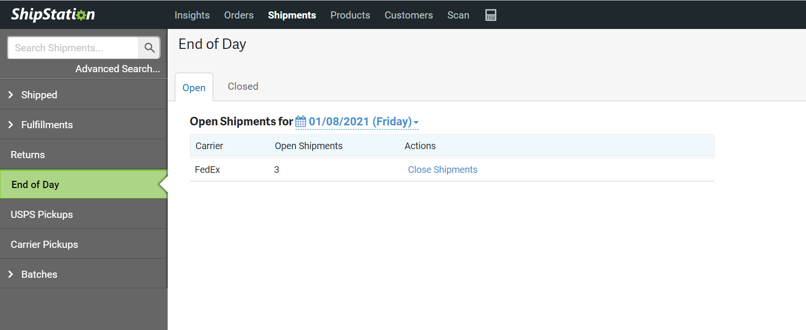

4. Click the **_Close Shipments_** link next to your carrier. You will see a screen similar to the following.

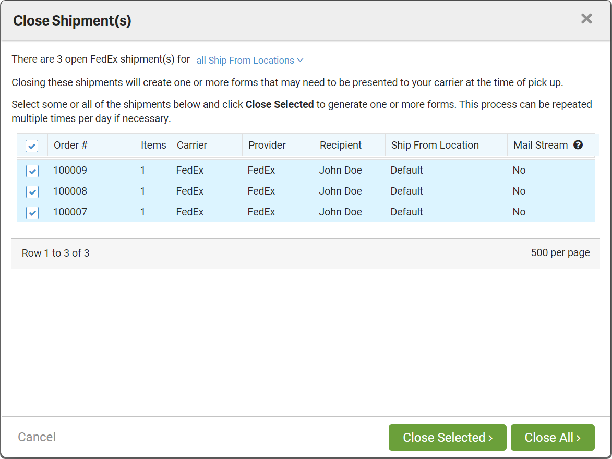

5. Click **_Close All_** button to include all the shipments in the manifest.
6. Confirm that no errors are displayed. You will see a screen similar to the following.

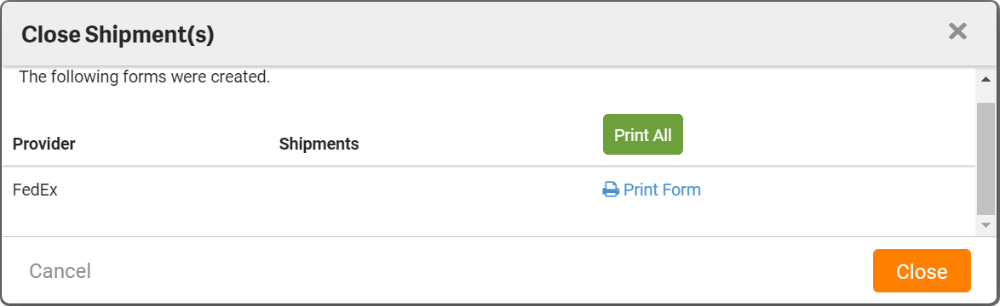

7. Click the **_Print Form_** link next to your carrier. On this screen, you can preview your manifest form, download it,
and print it out.

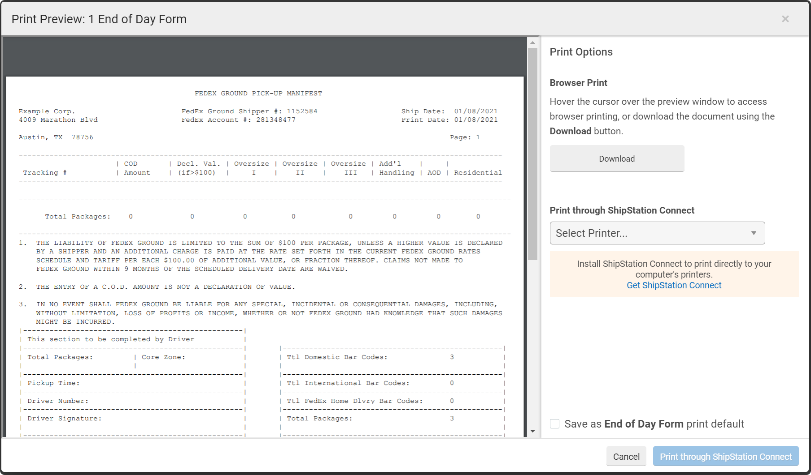

8. Repeat the setup steps and create a manifest for a subset of your shipments. You can do this in the **_Close Shipments_**
screen, shown above, once you click **_Close Shipments_** screen above. You can also change the Ship From location
you want to create the manifest for in the drop-down at the top of the screen. Now that you have created a manifest, it
useful to go through the workflow with different options selected. You should ensure that no errors are generated,
that you can download the manifest, and that the data in it is correct for all test runs.
