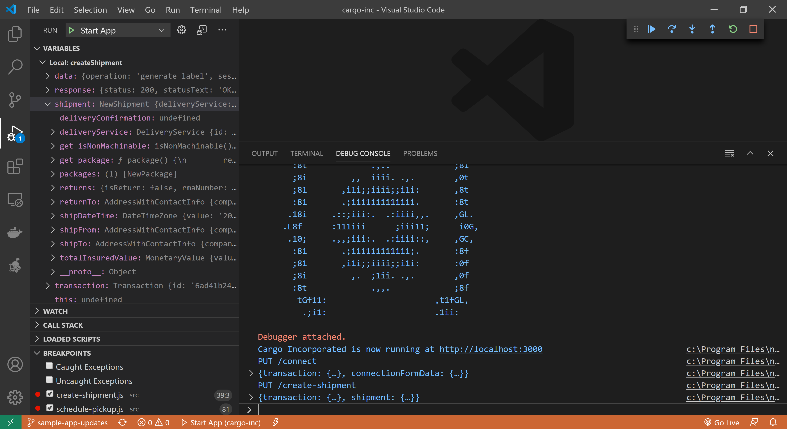
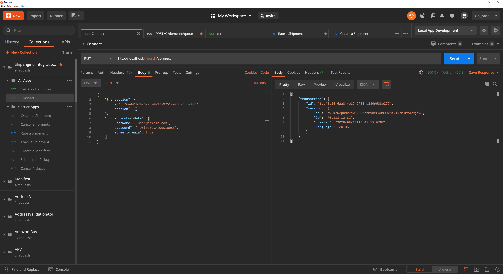

Testing Your Application
=============================
While developing your application, it's important to run tests to verify that your project structure is in the correct format and that your code behaves as expected.

There are multiple ways to test your application, and we suggest taking advantage of all of them to ensure the highest quality integration.

Local Testing
-----------------------------
The [`shipengine start` command](./../cli.md#run-your-app-locally) starts a local server that allows you to invoke your app's methods using [our Postman collection](#coming-soon). The server monitors your source code and automatically reloads your app whenever changes are detected, so if you find a bug, you can fix it and immediately retry.

> **PRO TIP:** You can use the [VSCode debugger](https://code.visualstudio.com/docs/editor/debugging) to set breakpoints, step through your code line-by-line, and inspect variables at runtime. Just press `F5` to start a debug session.

When beginning to work with our Postman collection, you should first run the `Connect` request to create a session. You will need to update
the properties in the request to match the names you used in your [connection form](./../reference/forms.md#connection-form-examples). This request
will return a [`transaction`](./../reference/transaction.md) object that you can then use in subsequent requests.

Each time you make a change to your code within VSCode, the server will automatically reload your application. This is a great
benefit during development, but your session data is not persisted between reloads. For this reason, it is simpler
to provide a valid `transaction` in each of your requests rather than having to run the `Connect` request again each
time the server reloads.

Each request in our Postman collection contains sample data that matches the structure expected by one of the methods in your application. We have included placeholder text
in the areas where you will need to provide values. For example, when running the `Create a shipment` request, you will need to provide IDs for
`shipment.delivery_service.id` and `shipment.packages[].packaging.id` that are defined in your application. You may also need to modify the `shipFrom` and `shipTo` properties
to addresses within your service area. Finally, you will need to ensure that the `shipDateTime` is in the future.

Automated Testing
-----------------------------
The [`shipengine test` command](./../cli.md#test-your-app) validates your application against our test suite. These tests are integration tests that represent real world, end-to-end scenarios.
Rather than calling a single, individual method, these tests may make calls to multiple method in order to construct a more realistic workflow.
For example, a single test may authenticate by calling your [`connect`](./../reference/methods/connect.md) method, create a shipment using your
[`createShipment`](./../reference/methods/create-shipment.md) method, and then use your [`cancelShipment`](./../reference/methods/cancel-shipments.md) method to
cancel the shipment.

These tests execute the entire application, so you won't be able to run this suite until you have finished implementing all the methods
in your application. For this reason, we recommend using the `shipengine start` command to perform testing during iterative development.

Once you have completed development,
this test suite can provide a higher degree of confidence that the application will work as expected when used from within one of our
e-commerce applications since this suite calls your application in the same manner in which it will be used in production.

You can find a breakdown of tests available for the Carrier App [here](./carrier-app-tests.md).

Unit Testing
-----------------------------
We recommend that in addition to using the `start` and `test` commands that you also you provide unit tests for your application. We don't include any
tooling or impose any restrictions on which tools you can use for writing unit tests. Here is a list of JavaScript test frameworks
that we recommend, but you can choose the tools you are most familiar with.
* [Jest](https://jestjs.io/)
* [Mocha](https://mochajs.org/)
* [Chai](https://www.chaijs.com/)
* [Nock](https://github.com/nock/nock)
* [Sinon](https://sinonjs.org/)

Live Testing
-----------------------------
Once you have completed local development and testing of your application, you can then [publish](./../publish.md) your app to
our development platform where you can perform live testing through one of our e-commerce applications, such as
[ShipStation](https://www.shipstation.com/), before it is promoted to our production platform.

  <a class="button button-small button-secondary" href="./../sandbox.md">Previous: Sandbox Environments</a>
  <a class="button button-small button-secondary" href="./../publish.md">Next: Publishing</a>

