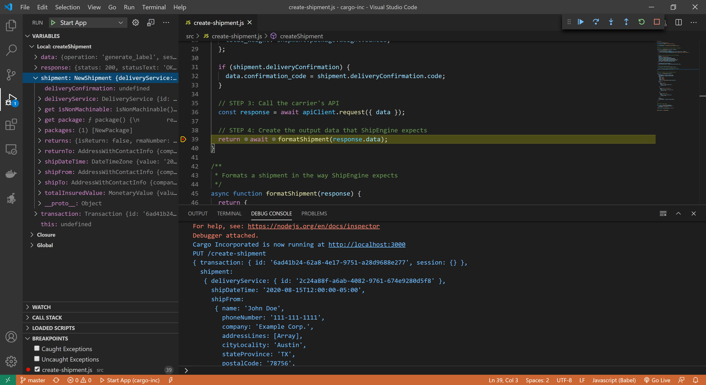

Testing Your Application
================
While developing your application, it is important to be able to run tests to verify that your project structure is in the correct format and that your code behaves as expected.

The [ShipEngine CLI](../cli.md) provides a way to test your application's methods for structural and logical correctness via the `shipengine test` command.


> **Info**
> Your application must implement the [connect method](../reference/methods/connect.md) before you can run the rest of the test suites.
> The connect method must be implemented in all [ShipEngine Integration Platform](./index.md) applications. This method must be called to perform authentication before any of the other methods can be called.
>
> Please [configure your tests](index.md#connectionformdataprops) with valid authentication information.


Test Suites and Hashes
----------------------

The `shipengine test` command will examine your application, set your environment's `NODE_ENV` variable to `test`, and run test suites for all [application methods](../structure.md#methods) that are present
in your application. It uses the [application's definitions](../structure.md#definitions) to generate test data for all the unique combinations of service options defined in your application definition
files.

Each test will have a unique hash generated that will be persisted between each test run so that it can be used for [grep](index.md#grep) commands and [test negation](index.md#negatetests).

### Example Output

In the output below, `(de6134c)` is an example of a test hash.
```bash
test cancelPickups
  PASS  (de6134c) cancels pickups with pickup service: Drop Off, delivery service: Same Day Delivery, package: Box, package unit: g, package weight: 1, time window start: Today, time window end: Tomorrow, and reason carrier_failed_pickup
  PASS  (5e0a907) cancels pickups with pickup service: Drop Off, delivery service: Same Day Delivery, package: Envelope, package unit: g, package weight: 1, time window start: Today, time window end: Tomorrow, and reason carrier_failed_pickup
  PASS  (b669dac) cancels pickups with pickup service: Drop Off, delivery service: Same Day Delivery, package: Bag, package unit: g, package weight: 1, time window start: Today, time window end: Tomorrow, and reason carrier_failed_pickup
  PASS  (5202d96) cancels pickups with pickup service: Drop Off, delivery service: Same Day Delivery, package: Box, package unit: g, package weight: 10, time window start: Today, time window end: Tomorrow, and reason carrier_failed_pickup
  PASS  (56e1c39) cancels pickups with pickup service: Drop Off, delivery service: Same Day Delivery, package: Envelope, package unit: g, package weight: 10, time window start: Today, time window end: Tomorrow, and reason carrier_failed_pickup
```


Configuring your Tests
----------------------
You should add a `shipengine.config.js` file to the root of your project directory to configure your application's tests. In this file, you can specify the following properties:

### connectionFormDataProps

This property allows you to specify valid login credentials for your application. The structure of this data should match what was specified in the [connection form](../reference/forms.md) for your application.
This allows the CLI to test your application's [connect method](../reference/methods/connect.md) and generate a valid session, which will be used in each subsequent test.

#### Example Implementation

The following example demonstrates using a `.env` file to store valid user credentials that get loaded with the [dot-env npm module](https://www.npmjs.com/package/dotenv-flow).
The `.env` file sets [environment variables](https://en.wikipedia.org/wiki/Environment_variable) that are then utilized within your `shipengine.config.js` file at runtime via the `process.env` convention.

Make sure the variable names in your
`shipengine.config.js` file match those in your `.env` file. For example, in the sample below, notice that the `EMAIL` property in the `.env` file is referred to as `process.env.EMAIL` in the `shipengine.config.js` configuration file.

Alternatively, you can set the values directly in the `shipengine.config.js` and you won't need a `.env` configuration. Wherever you choose to set your credentials, be sure not to check this file into source control since it contains sensitive data.


**shipengine.config.js**

```javascript highlights="4"
require("dotenv-flow").config();

module.exports = {
  connectionFormDataProps: {
    account_id: process.env.EMAIL,
    account_password: process.env.PASSWORD
  }
};

```

**.env**
```
EMAIL=test@test.com
PASSWORD=testing123
```

### negateTests

The vast majority of tests are dynamically generated based off of the application's definitions. The idea is to test all the permutations that the application should support.

However, there will always be cases that are specific to your application that are the opposite of what we expect. The `negateTests` array allows you to specify the specific test hashes for which you want the test command to negate the assertion,
thus allowing tests that would normally fail to pass.

An example would be if a package for a particular delivery service cannot weigh more than a certain amount. The CLI may generate tests that exceed the max weight and expect the tests to pass. You can use this property to mark it otherwise.

```javascript
module.exports = {
  negateTests: [
    "89848e9",
    "dfd1e1d",
    "ab6aa13",
    "1e70a8a",
    "208d6de"
    ]
};
```

Flags
------
The ShipEngine CLI allows you to set the following flags when running the `shipengine apps:test` command.

### Concurrency
This flag allows you to specify how many tests you wish to run concurrently. The default value is `1`. Increasing this value will allow multiple tests to run at the same time. While this will speed up the test execution, keep in mind that it
will generate more concurrent load on your backend API or service, unless you have a [sandbox](./../sandbox.md) environment, as well as use more resources on the machine on which you are running this command.

`shipengine apps:test --concurrency 4`
`shipengine apps:test -c 4`


### Fail Fast
This flag causes test execution to stop once the first test failure is encountered. The default value is `false`.

`shipengine apps:test --fail-fast`
`shipengine apps:test -f`


### Grep
This flag allows you to specify a specific test suite or individual test hash to run. When you use this flag, the command will only run those tests that you specified.

`shipengine apps:test --grep="rateShipment"`
`shipengine apps:test -g="5570257"`

### Debug
This flag allows you to see more information about a test failure, such as the complete stack trace of the failure. This can be useful in debugging test failures.

`shipengine apps:test --debug --grep="5570257"`
`shipengine apps:test -d -g="5570257"`


Visual Studio Code
------------------

When [creating your application](./../create-first-app.md), if you indicated that you are using [Visual Studio Code](https://code.visualstudio.com/) as your development environment,
the command automatically added a debug command in the scripts section of your `package.json` file and generated a `.vscode/launch.json` file.

This allows you to set breakpoints inside of your methods within VS code, that will be hit when you run the `shipengine apps:test` command, halting test execution and allowing you to
better debug your application and resolve test failures more quickly.

You will need to set a break point inside your desired method, and run the **Launch via NPM** VS Code configuration before running the `shipengine apps:test` command.




<div class="previous-next-nav">
  <a class="button button-small button-secondary" href="./../sandbox.md">Previous: Sandbox Environments</a>
  <a class="button button-small button-secondary" href="./../publish.md">Next: Publishing</a>
</div>
